# ColorGradingCustom 调色预设

`ImageProcess` → `调色`（`ImageProcessEffect.ColorGradingCustom`）的预设菜单根级只剩 `默认`（重置），所有 look 统一走 5 个子菜单，共 **34 个**：原有 `暖调 / 冷调` 已并入 `基础` 组，参数**原样保留**（见文末说明）。

| 菜单 | 内容 |
| --- | --- |
| `基础/*` | 原有暖调 / 冷调 |
| `电影感/*` | 商业大片、类型片 |
| `胶片/*` | 胶片型号与印片工艺 |
| `动画/*` | 日系动画 / 赛璐璐 / 写真调 |
| `风格/*` | 其他常用风格化与人像保护 |

预设表写在 `Editor/PostProcessing/ImageProcess/ImageProcessStackVolumeEditor.ColorGradingLooks.cs`，由预设菜单 `调色 → 基础/…` 调用。每个 look 只写 `ColorGradingCustom` 一层的参数：不新增效果、不改 shader、不引入资源依赖。

> **预览图**由 `sim.js`（shader 数学的 1:1 复刻）作用在合成测试场景上生成，**不是 Unity 实机渲染**。左=原图，右=该 look。用途是让参数表可读；最终效果必须在实机确认。

## 一览

### 基础

| # | 名称 | 取向 | 预览 |
| --- | --- | --- | --- |
| 1 | 暖调 | 原有预设：gamma 偏红、gain 偏红压蓝 | 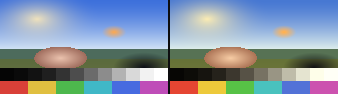 |
| 2 | 冷调 | 原有预设：gamma 偏蓝、gain 偏蓝压红 | 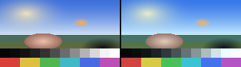 |

### 电影感

| # | 名称 | 取向 | 预览 |
| --- | --- | --- | --- |
| 3 | 青橙大片 | 青影 ~195°、橙在高光、不压黑 | 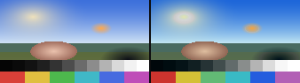 |
| 4 | 漂白旁路 | 去饱和 ~40%、压中间调、略偏棕 | 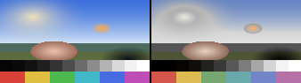 |
| 5 | 暗绿罪案 | 橄榄黄绿 ~75–100°、浓黑、去饱和 | 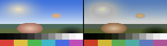 |
| 6 | 银翼琥珀 | 冷青蓝 + 琥珀高光、黑不死压 | 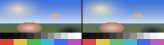 |
| 7 | 末世废土 | 脏黄绿、低对比抬黑、蓝压得最狠 | 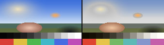 |
| 8 | 黑客绿 | 阴影死饱和绿 ~120°、中间调偏黄 | 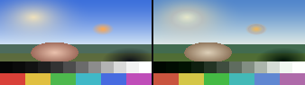 |
| 9 | 教父琥珀 | 琥珀暖调 + 染料转印浓黑 + 欠曝 | 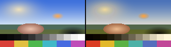 |
| 10 | 月光夜戏 | 淡紫蓝、越深越偏海军蓝、低对比低饱和 | 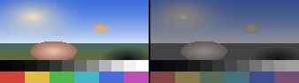 |
| 11 | 北欧冷调 | 强去饱和 + 弱冷调（方向有分歧） | 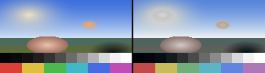 |
| 12 | 赛博霓虹 | 青影 + 洋红高光（类型化处理） | 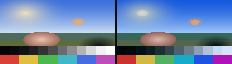 |
| 13 | 交叉冲洗 | 青绿阴影 + 洋红中性 + 金黄高光 | 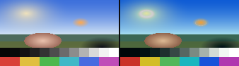 |

### 胶片

| # | 名称 | 取向 | 预览 |
| --- | --- | --- | --- |
| 14 | 柯达 Portra 400 | 低对比、白点 ~0.98、饱和 −2% | 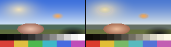 |
| 15 | 富士 Eterna | 柔灰低对比、阴影偏青蓝 | 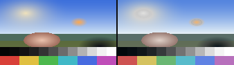 |
| 16 | CineStill 800T | 绿转青、红光晕高光（日光偏蓝） | 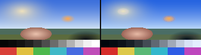 |
| 17 | 柯达 2383 印片 | 陡中间调 + 略高于纯黑的弧形脚 | 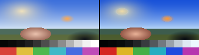 |
| 18 | 特艺三色 | 中性浓黑 + 极高对比 + 绿蓝原色饱和 | 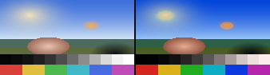 |
| 19 | 爱克发 Ultra 100 | 饱和 +15%、黑压到 0、白点不压 | 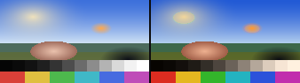 |
| 20 | 富士 Velvia 50 | 饱和 +25%、风光反转片 | 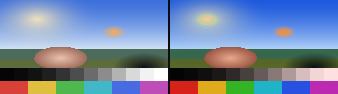 |
| 21 | 柯达 Kodachrome | 阴影偏蓝、高对比、绿蓝红极饱和 | 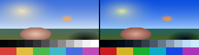 |
| 22 | 黑白胶片 | 中性黑白（近似，见下） | 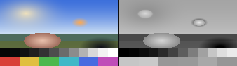 |
| 23 | 黑色电影 | 高反差黑白、单光源 | 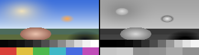 |
| 24 | 复古棕褐 | Sepia / 老照片 | 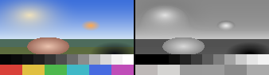 |

### 动画

| # | 名称 | 取向 | 预览 |
| --- | --- | --- | --- |
| 25 | 新海诚青空 | 天空色相带 194–209°、低亮度对比 + 高彩度对比 | 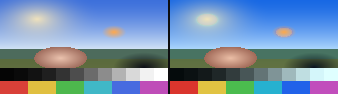 |
| 26 | 京阿尼通透 | 通透低对比（**无公开数值，属本表插值**） | 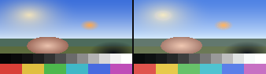 |
| 27 | 日系空气感 | 抬黑 + 低对比 + 高光偏青、绿转青 | 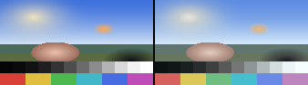 |
| 28 | 赛璐璐高饱和 | 黑不是纯黑、阴影偏蓝紫、肤色阴影偏红 | 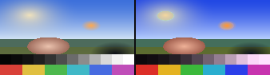 |
| 29 | 怀旧动画胶片 | 抬黑、温和对比、相对数字动画略去饱和 | 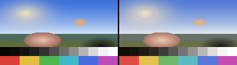 |

### 风格

| # | 名称 | 取向 | 预览 |
| --- | --- | --- | --- |
| 30 | 韦斯粉彩 | 低彩度粉彩（抬黑为本表插值） | 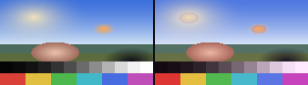 |
| 31 | 艾米丽绿金 | 金绿 + 大量红、蓝色极度去饱和 | 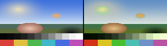 |
| 32 | 浪漫暖阳 | Golden Hour 暖阳 | 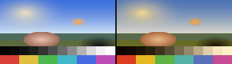 |
| 33 | 寒冬冷冽 | 冷调雪景 | 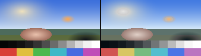 |
| 34 | 肤色保护 | 橙去饱和 8–12% 并提亮、清污染 | 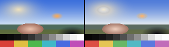 |

## 参数语义（写预设前必读）

`ColorGradingCustom.shader` 的最终公式：

```text
graded = pow(src + lift', gamma') * gain'
graded = graded + shadowWheel    * shadowWeight
                + midWheel       * midtoneWeight
                + highlightWheel * highlightWeight
graded = sixColourAdjust(graded)          // HSV 域：色相/饱和度/明度/明度带饱和度
out    = lerp(src, graded, intensity)
```

- **色轮（`parameters0..2`）与对数色轮（`parameters3..5`）永远同时生效**；UI 的 `类型` 下拉只切换“显示哪一组”。本批 look 全部使用 `类型 = 色轮`，对数色轮保持 0，所以参数在默认 UI 下完全可见。
- `lift'` = `saturate(rgb) - luminance + w`；`gamma'` = `rcp(saturate(rgb) - luminance + w + 1)`；`gain'` = `saturate(rgb) - luminance + w + 1`。中性值 `(1,1,1,0)`。
- 对数色轮的通道被 `saturate()` 夹到 `[0,1]`，**只能加不能减**；只有 `w` 可以为负。
- **六色调整 4 个模式共享 `parameters7..12`（24 个浮点）**，打包由 shader 的 `GetSixColorValue(mode, index)`（`valueIndex = mode * 6 + index`）决定：

  | 模式（UI `模式`） | 索引 | 落点 |
  | --- | --- | --- |
  | 0 色相对色相 | 0..5 | `p7.x p7.y p7.z p7.w p8.x p8.y` |
  | 1 色相对饱和度 | 6..11 | `p8.z p8.w p9.x p9.y p9.z p9.w` |
  | 2 色相对明度 | 12..17 | `p10.x p10.y p10.z p10.w p11.x p11.y` |
  | 3 明度对饱和度 | 18..23 | `p11.z p11.w p12.x p12.y p12.z p12.w` |

  每个模式内部顺序为 **红 / 黄 / 绿 / 青 / 蓝 / 洋红**（色相带中心 0°、60°、120°、180°、240°、300°）；模式 3 按 **亮度 0.0 / 0.2 / 0.4 / 0.6 / 0.8 / 1.0**。打包实现：`PackColorGradingSixColor`。
- `parameters6` = `(阴影范围, 高光范围, 色轮类型, 色偏模式)`，本批用默认 `(0.3, 0.55, 0, 0)`。

## 取值约定（从 shader 数学推出，并用 `sim.js` 逐个验证）

1. **S 曲线** = `lift.w < 0`（压黑）+ `gamma.w < 0`（压中间调）+ `gain.w > 0`（抬白）；中间调大致守恒，只拉开两端。
2. **褪色 / 高调** = `lift.w > 0` + `gain.w < 0`（抬黑必须配降增益）。只抬 `lift.w` 会把已经在 1.0 的高光推到 1.0 以上，而本效果在色调映射之后执行，溢出无法恢复。
3. **暖色用“压绿蓝”而不是“抬红”**：`gain` 红通道 > ~1.02 时，已经到 1.0 的暖色高光必然溢出。
4. **曝光优先 `gamma.w`**（对 1.0 输入幂等），`gain.w` 只做小幅白点。
5. **红色带的 sat 偏移会打到中性灰**：`d == 0` 时 hue 记为 0（红带），所以红带 sat 保持 ≤ +0.12，否则纯灰被染红、皮肤过饱和；绿/青/蓝/洋红可以推得更狠。
6. **皮肤**：参考 Van Hurkman 的肤色带（肤色应贴在肤色线上 **±2°** 内，饱和度约 15–40%），本批 look 的肤色色相偏移控制在 ≤ 12°；`暗绿罪案`（12°）、`黑客绿`（16°）、`艾米丽绿金`（16°）是刻意类型片偏色。
7. **HSV 去饱和会把饱和色提亮**（`hsv.y → 0` 时 `V = max(r,g,b)` 而非亮度）。`黑白胶片 / 黑色电影 / 复古棕褐` 用每色相 `明度` 偏移做有限补偿，但**高饱和红/蓝仍会偏亮**——这是 shader 的固有性质。需要严格亮度守恒的黑白应改用别的手段。

## 取值来源与可信度

研究报告的三条总结，直接决定了本表哪些数字可信：

1. **没有任何一个胶片/影视来源给出色相角度、RGB 三元组或 IRE 数值。** 所有 tint *方向* 都是定性的。真正有数字的只有：EI/滤色片表、mired、LAD 与公差、印片灯号（1 点 = 0.025 log exposure，中性 25-25-25，数字等价 Cineon 445-445-445）、白点色度、Kodachrome 密度、Portra 的 red-density / Print Grain Index，以及动画侧的色トレス hex 表、Your Name 实测调色板、teal-push 与肤色 qualifier 数值、Lightroom/Resolve 配方值。
   → **因此本表里每个 look 的色相角度都是本表插值**，标签只保证“方向与量级有依据”。
2. **“Orange & Teal”本身是这套里来源最弱的概念**：主要活在 LUT 销售页上，而 BR2049 / Fury Road 的一手资料描述的是**受限的、选择性的**调色板。所以 `青橙大片` 应视为“通用商业大片方向”，不是某部片的还原。
3. **很多 look 有 50% 是美术/布光而非调色**：Amélie 把布景刷成极蓝以对抗去饱和、Fury Road 的美术刻意做成中性米色好让天空承担全部颜色、Matrix 连道具都按绿色控制。**把预设套到任意素材上，效果会明显弱于参考剧照。**

主要依据（按 look）：

| look | 依据 / 修正 |
| --- | --- |
| 青橙大片 | 阴影青影 ~185°、sat +15–20 落在 170–195°“不要越过纯蓝”；橙进中间调/高光；黑不死压（[PremiumBeat](https://www.premiumbeat.com/blog/blockbuster-looks-in-davinci-resolve-transformers/)、[blkrip](https://blkrip.vip/blog/teal-orange-color-grading/)） |
| 漂白旁路 | 一线调色师口径：~40% 去饱和 + 压中间调 + 偏棕；轻量版 ~20%，重版 40–50%；银盐保留同时抬白（[LiftGammaGain](https://liftgammagain.com/forum/index.php?threads/how-to-get-the-skip-bleach-look.3824/)） |
| 暗绿罪案 | Se7en 用 CCE 银盐保留（**在印片上，负片没跳漂**）+ Panaflasher；病态黄绿 + 浓黑（[Cinematography.com / David Mullen ASC](https://cinematography.com/index.php?/forums/topic/55018-darius-khondji-seven/)） |
| 银翼琥珀 | Deakins：琥珀是**镜头滤镜 in camera**，不是 DI 整体校色；重制 look-build 记法：曲线偏阴影、顶端下压、RGB mixer 减红推青、高光偏黄橙、再把肤色从黄里拉回来（[rogerdeakins.com](https://www.rogerdeakins.com/forums/topic/use-of-tiffen-filters-in-blade-runner-2049/)、[RK Color](https://www.rkcolor.com/blog/look-builds-blade-runner-2049/)） |
| 末世废土 | 来源修正：**The Last of Us / Fallout 的描述已被撤回**。可用依据是 Dune（刻意去饱和、“把天空的蓝拿掉”、“less black”）+ The Walking Dead（脏黄绿、低对比、阴影带轻微黄、黄色高光去饱和）（[postPerspective / Greig Fraser](https://postperspective.com/cinematographer-greig-fraser-on-dunes-digital-film-process/)、[zunzheng 译文](https://zunzheng.com/news/archives/40157)）。**Fury Road 恰恰相反**：Miller 明确不要“去饱和漂白”的末世套路，夜间是 95% 蓝且抬黑（[Definition](https://definitionmagazine.com/features/mad-max-fury-road-the-ultimate-digital-intermediate/)、[Filmmaker U](https://www.filmmakeru.com/blog/colorist_eric_whipp)） |
| 黑客绿 | 矩阵内：阴影去饱和绿、中间调偏黄、整体压暗；该 look 故意破坏肤色线（[CINEGRADING](https://cinegrading.com/blogs/all/color-in-film-case-study-the-matrix-1999)、[PremiumBeat](https://www.premiumbeat.com/blog/blockbuster-looks-in-davinci-resolve-the-matrix/)） |
| 教父琥珀 | 琥珀暖调来自欠曝的胶片；浓黑来自 Technicolor V 染料转印印片（[filmcolors.org](https://filmcolors.org/galleries/the-godfather-1972/)、[Mullen ASC](https://cinematography.com/index.php?/forums/topic/20050-godfather-2/)）。注意：著名 sepia 闪回是第二部 |
| 月光夜戏 | 淡紫蓝、**对比与饱和都要往下走**、越深越从青转海军蓝；Tiffen 手册：日拍夜滤镜本身欠曝 2 档再加 0.5–1.5 档损失（合计 2.5–3.5 档）；月光实测约 4000–4100K 偏暖，蓝是影院惯例不是物理（[Tiffen 手册](https://manualsdump.com/en/manuals/tiffen_camera_filters/204190/17)、[CML / Mullen ASC](https://www.cinematography.net/edited-pages/MOONLIGH.htm)、[Company 3 讨论](https://liftgammagain.com/forum/index.php?threads/company3-tinting-blacks-neutrals-contemporary-blue-look.16713/)）。另有教程只推高光/中间调、不碰阴影（[Color Finale](https://colorfinale.com/blog/post/cf-day-into-night-08-25)），本表取宽推版本 |
| 北欧冷调 | 类型定义：去饱和灰/卡其 + 低照度（[WJEC/Eduqas](https://resource.download.wjec.co.uk/vtc/2016-17/16-17_1-30/website/eng/unit2/2.%20Media%20Language/2g-generic-signifiers-evident-in-the-bridge.html)）。**方向有分歧**（偏蓝青 vs 灰/卡其），且 Borgen 调色师明确说自己**不用** Nordic Noir 套路（[Televisual](https://www.televisual.com/news/colouring-borgen-something-other-than-nordic-noir_bid-526/)）→ 本表取“强去饱和 + 弱冷调” |
| 赛博霓虹 | 可考的洋红/青来源是 *The Neon Demon*（“黑底上的蓝与青、黑底上的红”）与 *Altered Carbon*，**不是 BR2049**（后者的琥珀是镜头滤镜）；真实影片底子很收敛、颜色来自**自发光光源**，故本 look 属类型化处理（[pushing-pixels](https://www.pushing-pixels.org/2017/04/09/the-art-and-craft-of-color-grading-interview-with-norman-nisbet.html)） |
| 交叉冲洗 | 青绿阴影 + 洋红中性区 + 金黄高光、对比 +30–50%、饱和上升（[Kubus Photo](https://www.kubusphoto.com/blog/cross-processing-explained)）；机制是**蓝通道最陡**（darktable：阴影青蓝 sat ~50%、高光黄橙 sat ~70%） |
| Portra 400 | 低对比、白点 ~0.98、饱和 −2%（[实现参数](https://docs.rs/oximedia-lut/latest/src/oximedia_lut/creative_grade.rs.html)）。**“抬黑”与“绿去饱和”在柯达 E-4050 中查无实据**，故本表把抬黑降到 +0.015 并在 ref 里标注 |
| 富士 Eterna | Vivid 才是高对比高饱和；“柔灰”属 Eterna 400/500；阴影偏**青蓝不是绿**（[Fujifilm 新闻稿转载](https://fsfsweden.se/ny_fujifilm_eterna_vivid_500_iso/) + 第三方实现参数） |
| CineStill 800T | 额定 3200K 下中性，5500K 日光才强烈偏蓝（85B）；**绿转青是色相旋转**；红光晕来自去掉 rem-jet 后红感光层背面再曝光（[Kubus Photo](https://www.kubusphoto.com/blog/cinestill-800t-guide)） |
| 柯达 2383 印片 | 官方：高 D-max 浓黑 + **中性高光** + 三条 toe 匹配更紧；实测补充：脚部有略高于纯黑的弧形“printy”台面；LAD 1.00 END（R1.09/G1.06/B1.03）；**无 gamma/D-min/D-max 公开值**（[Kodak](https://www.kodak.com/en/motion/product/post/print-films/vision-color-2383-3383/)、[Cullen Kelly](https://daejeonchronicles.com/2022/01/05/cullen-kelly-disentangles-pfe-befuddlement/)） |
| 特艺三色 | 第四遍“灰片”是绿记录的 50% 密度黑白拷贝，作用是**把黑做浓、做中性**（近似 proto-bleach-bypass），所以阴影不该染色；绿是最锐利的记录，**不该压绿**；实践口径是“饱和 +35–50% 再把肤色拉回来”（[widescreenmuseum](http://widescreenmuseum.com/oldcolor/technicolor6.htm)、[LiftGammaGain](https://liftgammagain.com/forum/index.php?threads/technicolour-3-strip-technique.5511/)）。注意：流传的 Baselight 三色矩阵是 L\*a\*b\* 域的 3D LUT，**不能直接用在 Rec.709 管线** |
| 爱克发 Ultra 100 / Velvia 50 | 实现参数：饱和 +15% / +25%，toe 在 0，白点 1.0（[实现参数](https://docs.rs/oximedia-lut/latest/src/oximedia_lut/creative_grade.rs.html)）。研究结论：**这两个和 2383 是数字赛璐璐最友好的三支**（不洗白也不抬黑） |
| 柯达 Kodachrome | 官方数据表 + 实测密度：阴影“slightly”偏蓝（蓝密度低于红）、对比相对高、K25 D_min 0.193（**不是抬黑**）、绿/天空“almost surreal”（[filmcolors.org](https://filmcolors.org/timeline-entry/40522/)、[kinograph 密度测量讨论](https://forums.kinograph.cc/t/kodachrome-colors/2863)） |
| 新海诚青空 | 官方访谈：**先把赛璐璐底色压暗再叠光**（不是整体提亮）；天空实测色相带 194–209°；亮度对比小于同类作品、靠彩度对比；白要柔和滚降（[CGWORLD](https://cgworld.jp/interview/201909-tenkinoko01.html)、[realsound](https://realsound.jp/movie/2020/12/post-677025_2.html)、[调色板实测](https://www.color5.com/upload/color-scheme/37665.html)） |
| 京阿尼通透 | **没有公开数值**（色相/对比/饱和都没有）；可查的只有方法（合成处理、`二十世紀電氣目録` 正片基本不用 flare）。本 look 属本表插值 |
| 日系空气感 | 配方值：抬黑（Blacks +66）、降白（Whites −30）、Contrast −25、Dehaze −19、Clarity −40；高光偏青 188° sat +7；绿 hue +11、蓝 sat −20（[配方](https://jump-show.hatenadiary.jp/entry/2020/08/31/174125)）。来源在“青在阴影还是高光”上互相冲突，本表取高光偏青 |
| 赛璐璐高饱和 | 动画业界实测：**“黑”不是 #000000**（底色 #3A3A3A、线 #151313）；阴影靠色相偏移而非压暗（布→蓝紫、肤→红）；线比填色更饱和（[色トレス 工具实测表](https://tooniq.co.jp/tools/color-trace/)、[GGXrd 着色器拆解](https://www.cnblogs.com/sevenyuan/p/12504875.html)） |
| 怀旧动画胶片 | 赛璐璐时代的颜料实测比播出画面**更艳**（要经过摄影与胶片），所以“90 年代”应是**略去饱和 + 温和对比 + 抬黑**；“暖洋红柔黑”查无实据（[loppo 技术博客](https://blog.loppo.co.jp/en/is-color-management-unnecessary-for-tv-anime-production/)、[CIE 色度图实测](https://blog.loppo.co.jp/en/plotting-cie-xy-chromaticity-diagram/)） |
| 韦斯粉彩 | 只有“1930 年代段去饱和 + 逐镜 power window”有据；“抬黑”是 LUT 销售页说法，本表标注为插值（[postPerspective](https://postperspective.com/enhancing-color-grand-budapest-hotel/)） |
| 艾米丽绿金 | Delbonnel：**金绿 + 大量红**，蓝色被极度去饱和（布景因此刷成极蓝）；妆面偏灰以防脸掉进金绿（[Delbonnel 访谈](https://www.sharonknolle.com/delbonnel.html)、[DV Info](https://www.dvinfo.net/forum/photon-management/6511-greenish-hue-amelie.html)） |
| 肤色保护 | 橙 hue −3..−5、sat −8..−12、lum +5..+10；qualifier 133°±8° 拉回 10–15% 饱和；肤色带应为肤色线 **±2°**（Van Hurkman 表）（[配方](https://blkrip.vip/blog/teal-orange-color-grading/)、[Van Hurkman 表转载](https://larryjordan.com/articles/the-secret-to-setting-skin-colors-accurately/)） |

## 数值核对结果

`sim.js` 用 13 个测试色（肤色亮/暗、天空、植被、中灰、暗部、高光云、暖光、夜景蓝、纯红/绿/蓝、**纯白**）逐个 look 统计肤色色相/饱和度/亮度、天空饱和度、中性灰染色、暗部与高光亮度、以及溢出。

- 测试色（最亮 0.97）范围内：34 个 look 中 32 个 **≤ 1.018**；另两个是原样保留的 `暖调`（1.046）与 `冷调`（1.047），见下。
- **真实纯白 (1,1,1) 输入**：最多的 `赛璐璐高饱和` +3.7%，`新海诚青空`/`京阿尼通透` +2.7%，`艾米丽绿金` +2.5%，其余 ≤ +2.2%。这是 S 曲线抬白点（`gain.w > 0`）的必然结果——中性 gain 轮只要 `w > 0`，1.0 输入就必然 >1.0。纯白本身已经是白，轻微溢出不影响观感；要严格不溢出就把该 look 的 `gain.w` 收到 0（代价是高光滚降变平）。

保留的类型片意图（实测值）：

- 刻意肤色偏色：`黑客绿` 16°、`艾米丽绿金` 16°、`暗绿罪案` 12°、`交叉冲洗` 10°、`青橙大片` 8°、`末世废土` 7°。
- 刻意去饱和：`漂白旁路`（天空 −0.27）、`月光夜戏`（−0.27 且亮度 −0.21）、`北欧冷调`（−0.19）、`寒冬冷冽`（−0.18）、黑白系列（−1.0）。
- 刻意压黑：`黑色电影`、`暗绿罪案`、`特艺三色`；刻意抬黑：`日系空气感`、`怀旧动画胶片`、`末世废土`、`月光夜戏`、`韦斯粉彩`、`银翼琥珀`。
- 刻意低对比：`末世废土`、`银翼琥珀`、`富士 Eterna`、`日系空气感`、`柯达 Portra 400`。
- 刻意去压天空蓝：`末世废土` −0.29、`漂白旁路` −0.27；刻意推天空彩度：`特艺三色` +0.26、`柯达 Kodachrome` +0.23、`交叉冲洗` +0.20。
- 近中性（中性灰染色 < 0.03）：`银翼琥珀`、`富士 Eterna`、`黑白胶片`、`北欧冷调`、`肤色保护`、`青橙大片`、`末世废土`。

## 实机使用注意

- **色调映射设置会影响这些 look**：URP 的 Grading Mode 建议用 **HDR**；LDR 下 Unity 会在自定义 tone mapping 之前套内部 LUT，颜色会不对（[ASP 文档](https://erichu33.github.io/ASPDocs/en/articles/tone-mapping-for-cel-shading-characters.html)）。另外 Filmic/ACES 本身会压低高饱和卡通色的饱和与亮度，若角色发灰可把角色 tone map strength 调到 0.25–0.7，或改用 Khronos PBR Neutral。
- **多数 look 有一半是布光与美术**，而且不少是“逐场景”而非全片统一（BR2049、布达佩斯大饭店、Fury Road、Se7en 都是逐场处理）。把单个预设套到任意素材上，效果一定弱于参考剧照。
- **想要更接近成片，建议叠层**：这三类 look 之后可再挂 `柯达 2383 印片`（2383 的橙青分离比 2393 强，正适合青橙/赛博/夜戏方向；需要干净中性阴影时反而应换 2393 思路）。需要颗粒/暗角/黑边时另加 `颗粒 / 暗角 / 电影黑边` 层。
- `柯达 2383 印片` 是**印片方向的近似**，不是 Resolve 那种 Cineon-log 输入的真印片 LUT；直接套在 display-referred 颜色上不构成“忠实胶片仿真”。
- **黑白有两种取向**：`黑色电影` 是年代片的高反差压黑；如果想学 *The Man Who Wasn't There* 那种“黑更深但保留层次、高光不炸”的现代黑白，应把 `黑色电影` 的 `伽马` 往 0 收回并改用 `色阶` 层做曲线。另外本 shader 的 HSV 去饱和按 `V = max(r,g,b)` 映射，不是按亮度；真要做亮度守恒的黑白，需要 RGB Mixer 式的权重（本效果没有）。
- 预设只写单层参数。影视里常见的完整 look（对比 + 调色 + 颗粒 + 暗角）需要用户自己叠层，本批没有做多层预设。

## 如何新增/修改一个 look

包内 `ImageProcessStackVolumeEditor.ColorGradingLooks.cs` 的表就是 shipped source of truth。下面这套工具是本机验证用的，在 `.codex-research/grading_sim/`（该目录已在 `.gitignore` 中，不随包发布，和仓库里其它验证脚本同一惯例）：

1. 改 `.codex-research/grading_sim/looks.js`。
2. `node sim.js` 看数值，`node sheet.js` / `previews.js` 出预览图。
3. `node gen_csharp.js` 生成 C# 表。
4. `node verify_csharp.js` 反解 C# 表逐字段比对，并校验 `PackColorGradingSixColor` 的每个 `(模式, 颜色)` 落点与 shader 的 `GetSixColorValue` 一致。
5. `node menu.js` 打印最终菜单树。
6. `& .codex-research/check_compile.ps1` 确认 Editor/Runtime 两个程序集 0 error。
7. `node fix_doc_index.js` 在表格顺序变化后，按 `index.json` 重排本文档一览表的编号与图片路径。

`previews.js` 会刷新本目录 `Images/ColorGrading/` 的预览图与 `index.json`（编号 → 文件名 → 取向）。没有这套工具时也可以直接改 C# 表：`Six(...)` 顺序固定为 **红/黄/绿/青/蓝/洋红**，四组依次是 **色相 / 饱和度 / 明度 / 明度带饱和度**。

## 关于原有 `暖调 / 冷调`

这两个预设是从 `ImageProcessStackVolumeEditor.Presets.cs` 直接搬进表的（`基础` 组），**参数一字未改**，只是为了统一预设入口、让它们也走同一套应用逻辑：

| 名称 | gamma | gain |
| --- | --- | --- |
| 暖调 | `(1.00, 0.95, 0.88, +0.03)` | `(1.08, 1.02, 0.92, +0.04)` |
| 冷调 | `(0.90, 0.96, 1.08, +0.02)` | `(0.92, 1.00, 1.12, +0.03)` |

注意它们写在本文档的取值约定之前：两个都抬白点，`gain.w > 0`，所以在真白上分别溢出 **+4.6% / +4.7%**（测试色里 `冷调` 的高光云蓝通道到 1.018）。如果想和新表一致，把 `gain.w` 收到 0 并把暖/冷改由“压绿蓝”表达即可（例如 `暖调` → `gain=(1.00, 0.98, 0.92, 0)`），但那会改变现有观感，所以这里保留原样。

## 尚未验证的部分

- **没有在 Unity 里实机跑过**：本批只做了 shader 数学复刻 + 合成场景预览 + 独立 Roslyn 编译检查（0 error）。
- 预览用的合成场景只有天空/地面/皮肤/高光/阶调/色卡，不代表真实镜头；`银翼琥珀`、`京阿尼通透`、`肤色保护` 这类轻量 look 在实机上可能比预览更弱。
- 每个 look 的色相角度都是插值（研究结论：影视来源不发布色相数值）；表内标签只保证方向与量级有依据。
- `京阿尼通透` 与 `怀旧动画胶片` 的“柔黑/暖调”部分没有一手数据支撑，已在表内标注。
