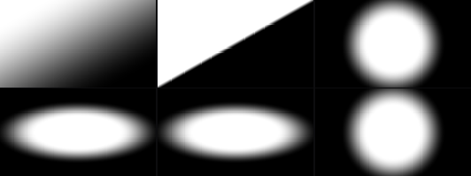
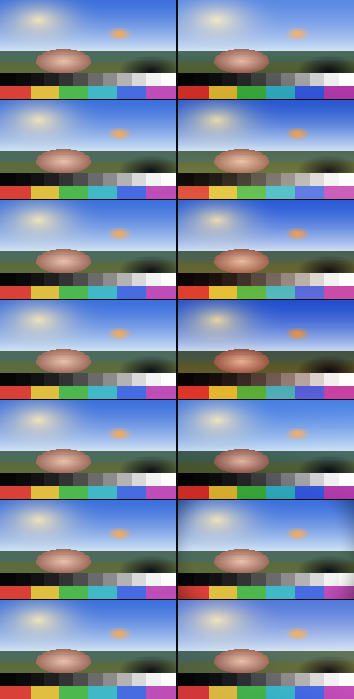

# Gradient 效果调查（现状 / 后期对应物 / 拓展方向）

调查对象：`ImageProcessEffect.Gradient`
- Shader：`Runtime/ImageProcess/Shaders/ImageProcess/Gradient.shader`
- UI：`Editor/PostProcessing/ImageProcess/Filters/Gradient.cs`
- 预设：`ImageProcessStackVolumeEditor.Presets.cs`（7 个）
- 执行：`Runtime/ImageProcess/Renderer/Effects/ImageProcessPass.Gradient.cs`（单 pass，无额外资源）
- 流水线位置：`ImageProcessRendererFeature` = `AfterRenderingPostProcessing + 1`，即**色调映射之后的图像域**，处理的是 display-referred 的相机颜色。

> 本文的数值与掩码图来自 `.codex-research/grading_sim/gradient.js`（对 shader 的 1:1 复刻）+ `gradient_sheet.js`。复刻脚本沿用 ColorGradingCustom 那套验证工具；**尚未在 Unity 实机核对**。

## 1. 现状：它实际是什么

数据只有 4 个 Vector4 + 图层自带的两个字段：

| 槽位 | 含义 |
| --- | --- |
| `parameters0` | `x` 模式（0 单色 / 1 线性 / 2 圆形 / 3 椭圆）、`y` 半径、`z` 柔和度、`w` 不透明度 |
| `parameters1` | `x/y` 中心偏移、`z` 角度（度）、`w` 反转 |
| `parameters2` | `x/y` 椭圆缩放、`z` **分辨率量化**（UI 未暴露）、`w` **抖动强度**（UI 未暴露） |
| `parameters3` | 颜色 2（另一端） |
| `color` | 颜色 1 |
| `blendMode` | 24 种 Photoshop 式混合模式 |
| `intensity` × `parameters0.w` | 两个强度旋钮相乘 |

计算过程（三段）：

```text
1) uv 量化（默认关闭）：targetRes = round(_ScreenParams.xy * p2.z); uv = (floor(uv*targetRes)+0.5)/targetRes
2) 掩码：
   模式 0 单色   mask = 1
   模式 1 线性   dir = (cos(a+90°), sin(a+90°)); pos = dot(uv-中心, dir)/半径 + 0.5
                 softness = lerp(0.02, 1.0, 柔和度/10); mask = smoothstep(0.5-soft, 0.5+soft, pos)
   模式 2/3 圆/椭圆  d = ((uv-中心).x*aspect, (uv-中心).y) / scale
                 softness = 半径 * 柔和度/10; mask = 1 - smoothstep(半径-soft, 半径, |d|)
   （可选）mask += (hash(pixel)-0.5) * 抖动/255     ← 抖动的是掩码，不是输出
   反转：mask = 1 - mask
3) 合成：layer = lerp(颜色2, 颜色1, mask)
        blended = Blend(源, layer, blendMode)
        out = lerp(源, blended, intensity * 不透明度 * layer.a)
```

所以：**它是"一个二色渐变当作图像层，再用 24 种混合模式之一压上去"**，掩码形状 4 种，另有一个 GameView 手柄（C 中心 / R 半径 / A 角度 / X,Y 缩放）。

## 2. 实测行为（证据）

### 2.1 七个预设到底做了什么（0.5 中灰上的探针）

| 预设 | 画面上 | 画面中 | 画面下 | 左上角 |
| --- | --- | --- | --- | --- |
| 顶光 | m=0.97 → 0.59 | m=0.50 → 0.50 | m=0.03 → 0.40 | m=0.99 → 0.59 |
| 底光 | m=0.03 → 0.41 | m=0.50 → 0.49 | m=0.97 → 0.58 | m=0.01 → 0.40 |
| 黄昏 | m=0.07 → 0.41/0.42/0.46 | m=0.38 → 0.49/0.45/0.45 | m=0.76 → 0.56/0.50/0.44 | m=0.04 → 0.41/0.42/0.46 |
| 黄昏夜晚 | m=0.04 → 0.37 | m=0.33 → 0.45/0.40/0.39 | m=0.71 → 0.54/0.44/0.40 | m=0.02 → 0.37 |
| 冷月夜 | m=0.88 → 0.52/0.54/0.57 | m=0.45 → 0.46/0.47/0.50 | m=0.06 → 0.40 | m=0.78 → 0.51/0.53/0.56 |
| 压暗圆形 | m=1.00 → 0.50 | m=1.00 → 0.50 | m=1.00 → 0.50 | m=0.63 → 0.41 |
| 暖色叠光 | m=1.00 → 0.57/0.53/0.49 | m=0.70 → 0.54/0.51/0.49 | m=0.18 → 0.46/0.47/0.50 | m=0.85 → 0.55/0.52/0.49 |

（`m` = 掩码；结果是在 0.5 灰上跑出来的 RGB。预设亮度变化都偏温和，因为 opacity 只有 0.35–0.58 且大多用 SoftLight。）

### 2.2 柔和度语义三种模式不一致，且低值直接是硬边（无抗锯齿）

沿渐变轴采 5 个点（0 / 0.25 / 0.5 / 0.75 / 1）：

| 模式 | 柔=0 | 柔=2 | 柔=5 | 柔=10 |
| --- | --- | --- | --- | --- |
| 线性 | 0.00 0.00 0.50 1.00 1.00 | 同左 | 0.00 0.02 0.50 0.98 1.00 | 0.02 0.21 0.50 0.79 0.98 |
| 圆形 | 0.00 1.00 1.00 1.00 0.00 | 同左 | 0.00 0.91 1.00 0.91 0.00 | 0.00 0.36 1.00 0.36 0.00 |
| 椭圆 | 全 1.00 | 全 1.00 | 0.53 1.00 1.00 1.00 0.53 | 0.17 0.69 1.00 0.69 0.17 |

- 线性模式：`softness = lerp(0.02, 1.0, 柔/10)` → **0–2 几乎就是硬切换**，有效区间只在 8–10。
- 圆/椭圆：`softness = 半径 * 柔/10` → **软硬度随半径变化**，同一个柔度值在不同半径下含义不同。
- 柔=0/2 时是 `smoothstep(e0, e0+0.0001, x)`，即**硬边且完全没有抗锯齿**（掩码图第 2 格可见锯齿）。

### 2.3 角度与画幅绑定：同一个 45° 在不同画幅上不一样

线性模式的方向定义在 UV 空间，不乘 aspect：

| 画幅 | 设定 45° 时等值线与水平的实际夹角 |
| --- | --- |
| 1:1 | 45.0° |
| 16:9 | **29.4°** |
| 21:9 | **22.9°** |
| 9:16 | **60.6°** |

同理，椭圆模式**没有旋转**：`角度` 在模式 3 下完全不参与计算（掩码图第 4、5 格完全相同）。



*上排：线性 45°（柔=5）、线性 45°（柔=0，注意硬边锯齿）、圆形 r=0.6。下排：椭圆 1.6×0.6、椭圆再设 角度=45（与左格完全相同，说明椭圆不能旋转）、分辨率量化 0.08（shader 里已有、UI 未暴露）。*


*同一个 角度=45°：16:9（左）与 1:1（右）。*



*七个现有预设，左=原图，右=结果。*


### 2.4 染色不区分内容：皮肤和天空一起吃色

`黄昏`（SoftLight，opacity 0.52）在同一画幅内的实测：

| 采样 | 输入 RGB | 输出 RGB | ΔLuma |
| --- | --- | --- | --- |
| 皮肤（上半幅） | 0.86, 0.68, 0.60 | 0.83, 0.62, 0.56 | −0.054 |
| 皮肤（下半幅） | 0.86, 0.68, 0.60 | 0.87, 0.66, 0.55 | −0.014 |
| 天空（上） | 0.35, 0.58, 0.92 | 0.27, 0.50, 0.91 | −0.075 |
| 天空（下） | 0.35, 0.58, 0.92 | 0.42, 0.58, 0.90 | +0.011 |
| 高光云（上） | 0.95, 0.95, 0.97 | 0.93, 0.94, 0.96 | −0.014 |

上半幅的皮肤被拉低了 0.054 亮度并整体偏冷——**渐变只认位置，不认"这是天空还是脸"**。

### 2.5 藏在 shader 里但 UI 没暴露的两个能力

- `parameters2.z` **分辨率量化**：把 uv 量化到 `屏幕分辨率 × z` 的网格 → z=0.08 时掩码变成明显的方块（掩码图第 6 格）。等于"低分辨率渐变"，风格化很有用，但没有任何 UI。
- `parameters2.w` **抖动**：给掩码加 `(hash-0.5) * w/255`。注意它抖的是**掩码**而不是最终颜色，而且没有暴露；大范围平滑渐变在 8-bit 下会有条带，这个开关本来是对策。

### 2.6 其它可用性问题（读代码可确认）

- `intensity` 与 `不透明度` 相乘，两个旋钮功能重叠，用户不知道该动哪个。
- 模式 0「单色」= 全屏纯色层（掩码恒为 1），它和"渐变"不是一类东西，但混在同一个模式枚举里。
- 颜色 1 用图层通用的 `color` 字段（真 `Color`，带常规拾色器），颜色 2 存在 `parameters3`（UI 里是自绘的 `DrawVectorColorLine`）——同一件事两种编辑体验。
- `parameters2.x/y`（椭圆缩放）在模式 1/2 下不参与计算，但 UI 只在模式 3 显示 ✓；反过来 `parameters1.z`（角度）只在模式 1 显示 ✓ ——这两个是对的。
- 预设只有 7 个、都偏"氛围光"，没有"天空渐变 / 水下 / 回忆 / 分色"等常见用途的分类。

## 3. 后期合成那边的对应物

结论先说：**"屏幕空间的不均匀颜色"在后期里不是一个节点，而是三个不同家族**。我们的 Gradient 只实现了其中一支，而且实现方式跟后期惯用的组织方式不一样——这大概就是"找不到明确对应物"的原因。

### 家族 A：位置驱动的 ramp（＝我们的做法）

| 工具 | 参数 | 说明 |
| --- | --- | --- |
| **Natron / Nuke `Ramp`** | **两个点，每点各有 位置(x,y) + 颜色(RGBA)**；`type` = `linear` / `plinear`（"看起来更接近线性"）/ `smooth0`（缓入 point 0 端）/ `smooth1`（缓入 point 1 端）/ `smooth`（两端都缓）；`premult`、`invert`、mask 输入、`mix` | 关键结构差异：Nuke 的 `Ramp` **是遮罩发生器，不是调色工具**（官方描述："Generates a gradation between two defined edges"）。合成师的做法是 **matte → Constant/颜色 → Merge** 三步，而不是"一个渐变层"。我们的效果把三步合成了一个。[Nuke Ramp](https://learn.foundry.com/nuke/content/reference_guide/draw_nodes/ramp.html) · [Natron Ramp](https://natron-docs.readthedocs.io/en/sphinx_rtd_theme/plugins/net.sf.openfx.Ramp.html) |
| **Kino SkyboxPlus `Gradients`** | **4 层叠加**，每层 = `Direction`(3D 方向) + `Color` + `Exponent(1..20)` 衰减指数，加在 `BaseColor` 上 | keijiro 的做法是"叠几道不同方向、不同衰减曲线的染色"，而不是一个硬/软掩码。参考包内就有：`ReferencePackages~/KinoPostprocessing/.../Gradients.shader` |
| **DaVinci Resolve 渐变 Power Window** | 官方手册（DaVinci Resolve 20 Reference Manual，p.3190/3192–3193）原文：*"A simple two-handled control for dividing the screen into two halves, with options for the center, angle, and feathering of the shape. **Good for fast sky adjustments.**"* 手柄：拖中心点移动、拖底部箭头手柄旋转、拖洋红 softness 手柄调过渡；**只有一个 softness 参数 `Soft 1`**（"uniform softness of the gradient window's edge"） | 这是"位置渐变"在调色软件里的原生形态，也是我们两点几何的直接对标：**两个手柄 + 单一过渡**。注意它在 Resolve 里只是**遮罩源**（颜色由该节点的 grade 控制，另有 `Outside` 节点处理反选区域），不是二色 lerp |
| **实拍对应物** | **渐变 ND 滤镜**：硬边 / 软边 / **反向渐变**（reverse grad），标准密度 0.3 / 0.6 / 0.9（= 1/2/3 档） | 注意：ND grad 改的是**曝光**不是颜色；它压的是天空与地面之间的亮度差。"反向渐变"存在的唯一理由就是：太阳在地平线附近时，最亮的地方不在画面顶端 |

**家族 A 的共同点（我们缺的）**：
1. ramp 由**两个点**定义（每点都有位置），不是"中心 + 半径 + 角度"；
2. **每端都有 alpha**；
3. **插值/衰减曲线可选**（Linear / PLinear / Ease-in / Ease-out / Smooth），而不是单一"柔和度"；
4. 它是**遮罩/图层**，真正的调色交给 grade 节点做。

### 家族 B：亮度驱动的颜色映射（真正的"LUT"）

| 工具 | 参数 | 说明 |
| --- | --- | --- |
| **Photoshop `Gradient Map` / AE `Colorama`** | 一个多停靠点 ramp；**输入是像素亮度**。PS 版只有三个控件：渐变本身、**Dither**（"adds random noise… reduce banding effects"）、Reverse；官方描述 "maps the equivalent grayscale range of an image to the colors of a specified gradient fill"。Colorama 输入端可选 Intensity/Red/Green/Blue/Hue/Lightness/Saturation/Value/Alpha，输出是色轮上的三角形停靠点，最多 64 个 | 位置无关：同一个亮度在任何位置都映射到同一个颜色。**这才是"给画面套一个 LUT"的本体**。参考实现（GPU Gems 1 第 22 章）：`float grayscale = dot(float3(0.222,0.707,0.071), inColor); OutColor = tex1D(ColorCorrMap, grayscale);`（1×256 ramp） |
| **URP `SplitToning`** | `shadows` 颜色 + `highlights` 颜色 + `balance(−100..100)` | 引擎自带的二色亮度分离：暗部一个色、亮部一个色。位置无关 |
| **URP `ShadowsMidtonesHighlights`** | 3 个 Vector4 色轮 + 4 个过渡范围参数（阴影→中间调起止、中间调→高光起止） | 引擎自带的三段带权重调色，比二色分离更接近"分级"的概念。（本包的 `ColorGradingCustom` 对数色轮其实就是这个东西的加强版） |
| **Kino `ColorCorrectionRamp`（Standard Assets 同族）** | 一张 256×1 ramp 贴图 + blit | 经典"用 ramp 当 LUT"的最小实现；本包的 `MaterialGradient` 模块已经在做"Unity Gradient → 256×1 ramp 烘焙 + 采样"，可以直接接上 |

### 家族 C：语义/内容驱动的染色

- 天空替换 / 大气透视 / 光晕（aerial perspective）、Nuke 的 `LightWrap`、`Sky` 类工具的"depth-based haze"。
- 这类的输入不是"屏幕位置"，而是**深度、亮度、饱和度或语义遮罩**。屏幕位置只是这些量的一个粗糙代理——所以纯位置染色容易"糊在脸上"（§2.4 实测）。

### 对我们的意义

- 用户的直觉"本质是屏幕空间不均匀颜色的 LUT"其实混了两件事：**LUT（家族 B：亮度→颜色）** 与 **graduated filter（家族 A：位置→颜色）**。想要"LUT 的味道"，最直接的补法是加 **家族 B 模式**（ramp 由亮度采样，可复用 `MaterialGradient` 的烘焙管线）；想让位置渐变更像后期，则要补 **家族 A 的形态（两点 + 每点 alpha + 插值曲线）** 和"渐变当遮罩驱动 grade"的组织方式。
- 另一个现实约束：`ImageProcess` 按架构只读相机颜色（不消费 MetadataBuffer/GeometryBuffer），所以**不能**做深度/语义驱动的染色；亮度与饱和度驱动是允许的，也正好是"只染天空"最便宜的实现路径。


## 4. 差距清单（改造前）

按"表现力 / 正确性 / 可用性"三类。✅ = 本轮 A 已解决，⬜ = 留给后续。

**表现力**
1. ⬜ 只有两个颜色端，没有多停靠点。（注意：位置渐变的对标物 Nuke/Natron `Ramp` **也只有两端**——多停靠点属于家族 B，各做各的。）
2. ⬜ 渐变只驱动"二色 lerp"，不能驱动一组调色操作（曝/对比/饱和/色相/色温）。
3. ✅ 形状只有 4 种：没有**旋转椭圆**、没有锥形/扫掠、没有反向渐变（镜像）。
4. ⬜ 没有亮度/饱和度选择器（"只染天空/只染暗部"）——属于家族 B/C。
5. ⬜ 没有把渐变当**遮罩**去调制别的效果——属于 C。

**正确性**
6. ✅ 线性模式角度不按画幅校正（16:9 下 45° 变 29.4°）：新几何按画幅空间计算，旧模式给了可选的"角度按画幅校正"开关（默认关，保持老观感）。
7. ✅ 柔=0/2 是硬边且无 AA：现在所有模式都有 1.5px 的最小过渡带。
8. ✅ 没有线性光插值选项；旧的"抖掩码"也一并整理。（`Lum/Sat` 用的 0.3/0.59/0.11 **不是缺陷**：W3C 合成规范 §10.2 的非分离混合模式就是用这组系数，改反而会偏离参考实现。）
9. ✅ 抖动未暴露、且抖的是掩码：现在抖**输出**，单位是 8-bit LSB（1 = ±0.5/255），用对称三角分布。
10. ✅ 参数没有下限：半径/尺寸/过渡都给了下限。

**可用性**
11. ✅ `intensity` × `不透明度` 重复：UI 只保留 `不透明度`（图层强度仍是 `intensity`，两者相乘的关系写进了 tooltip）。
12. ✅ UI 不显示隐藏控制：分辨率量化与抖动都已暴露。
13. ⬜ 多停靠点预设库 / 与 `MaterialGradient` 打通——属于 B。
14. ✅ 椭圆不能旋转 → 两点椭圆由 A→B 方向决定旋转，手柄直接拖。
15. ⬜ 没有"仅染色保留亮度"的一键模式：现在 `Color`(22) 混合模式的语义就是它（W3C：*"preserves the gray levels of the backdrop… useful for tinting color images"*），只是还没有预设/说明。

## 5. A 已落地：位置渐变补全

### 5.1 做了什么

**几何：新增 4 个两点模式（mode 4..7），旧 0..3 原样保留**

| mode | 名称 | 几何 |
| --- | --- | --- |
| 0–3 | 单色 / 线性 / 圆形 / 椭圆 | **改动前的原实现**，数学逐行保留 |
| 4 | 线性（两点） | 沿 A→B 轴投影，A 端 = 颜色 2、B 端 = 颜色 1 |
| 5 | 径向（两点） | 以 A 为圆心、\|A→B\| 为半径 |
| 6 | 椭圆（两点） | 长轴方向 = A→B（**所以旋转靠拖 B**），形状由纵横比控制 |
| 7 | 锥形（两点） | 从 B 方向起绕 A 扫掠 |

两点几何全部在**按画幅校正的空间**里计算（`q = (uv.x·aspect, uv.y)`），所以等值线在屏幕上与 A→B 视觉垂直（16:9 下同比例偏移的 A→B 是 29.4°，1:1 是 45°，两个都正确）。1 个单位 = 屏幕高度。

**过渡与形状**
- `过渡曲线`：线性 / 平滑两端 / 缓入起点 / 缓入终点 / 更平滑——对应 Nuke `Ramp` 的 `linear / smooth / smooth0 / smooth1`，另外多一个 smootherstep。（为什么需要曲线：完全线性的 ramp 会因 **Mach bands** 在两端出现"看得见但其实不存在"的亮暗边；平滑曲线消除它。）
- `镜像`：以 A—B 中点对称 → 就是实拍 **反向渐变（reverse grad）**："最暗处在过渡带上、往两边变亮"。
- 所有模式都有 **1.5px 最小过渡带**（旧模式柔=0 时原来是 `e0→e0+0.0001` 的硬边，没有任何抗锯齿）。

**质量**
- `插值空间`：显示空间（默认，与改动前一致）/ 线性光。实测同一个黑白 50% 混合：显示空间 0.505，线性光 0.739（对上公开算例"50% 光应该是 186/255 ≈ 0.73"）。**两种都不是绝对正确**：显示空间会让宽渐变的中点发暗发闷，线性光会让明暗渐变的中点偏亮——所以是选项而不是替换。
- `渐变分辨率`：暴露原有的 uv 量化（0.02–1），低值得到方块化渐变。
- `抖动`：暴露并改成**作用在输出上**，单位 8-bit LSB、对称三角分布（±0.5/255 × 强度），实测 抖动=1 时峰峰 0.96 个码、=2 时 1.92 个码。这是压条带的手段，**和插值空间无关**（换插值空间不增加位深，加停靠点也不治条带）。

**UI**
- 模式下拉 8 项；两点模式下显示 A X/Y、B X/Y、过渡曲线、镜像、椭圆纵横比；旧模式保留原控件（半径/柔和度/偏移/角度/缩放）+ 新增"角度按画幅校正"。
- 颜色 2 现在用带 alpha 的拾色器（每端 alpha 都可编辑；颜色 1 的 alpha 本来就在图层 `color` 里）。
- GameView 手柄：两点模式画 A—B 虚线 + A/B 手柄（mode 6 多一个椭圆比例手柄 E），拖 B 就是旋转/缩放；旧模式手柄不变。

**预设**：新增 `天空 ND`（两点线性 + 平滑 + Multiply，就是渐变 ND 的做法）、`反向渐变`（镜像）、`旋转椭圆`、`锥形扫光`；原 7 个预设参数一字未改。

### 5.2 兼容性

- **没有新增任何图层字段**：全部塞进原有 `parameters0..5`（p4/p5 原本对 Gradient 完全没用）。属性绑定代码（`ApplyLayerProperties`）本来就把 p0..p12 全绑了，运行时契约没动。
- 旧 profile 的观感保持：mode 0..3 的公式逐行保留，唯一的差别是"柔度=0 的硬边"变成 1.5px 过渡（这是修锯齿，不是改观感）；`抖动`/`插值空间`/`画幅校正` 默认都是旧行为；旧的"抖掩码"行为删掉了（所有历史数据的 `p2.w` 都是 0，无影响）。
- `ResetEffectDefaults` 补了 p4/p5 的默认值（B 在中心下方、曲线=平滑、纵横比=1），所以新加的 Gradient 层切到两点模式就有可用形状。

### 5.3 参数对照（写预设/排查用）

| 槽位 | 旧含义 | 现在 |
| --- | --- | --- |
| `p0` | mode, 半径, 柔和度, 不透明度 | 同左（半径/柔和度仅旧模式用；两点模式用 p0.z 之外的空位不参与） |
| `p1` | 偏移 X/Y, 角度, 反转 | 偏移 X/Y = **点 A**；角度仅旧模式；反转通用 |
| `p2` | 椭圆缩放 X/Y, 分辨率量化, 抖动 | 同左；抖动改为输出端、单位 8-bit LSB |
| `p3` | 颜色 2 (rgba) | 同左（alpha 现在可编辑） |
| `p4` | —（未使用） | **B X, B Y, 过渡曲线, 镜像** |
| `p5` | —（未使用） | **椭圆纵横比, 插值空间, 旧模式画幅校正, 预留** |

### 5.4 验证

- `gradient_check.js`（对 shader 的 1:1 复刻）：
  - **旧预设逐项回归**：7 个预设的掩码与输出与改造前完全一致（顶光/底光/黄昏/黄昏夜晚/冷月夜/压暗圆形/暖色叠光）。
  - 两点模式沿轴采样：线性 0/0.25/0.5/0.75/1 精确成比例；镜像得到 1/0.5/0/0.5/1 的带；径向/椭圆沿轴一致；锥形按角度分布。
  - 五条曲线在同一斜坡上的取值互不相同且与定义一致。
  - AA 下限：柔度=0 的圆形在半径 0.58/0.59/0.595/0.60 处得到 1.000/0.732/0.255/0.000（1.5px 过渡带）。
  - 插值空间与抖动的实测值见 5.1。
- 独立 Roslyn 编译（Editor + Runtime 两个程序集）：**0 error**。
- `.codex-research/shader-check/`（新增）：把 shader 的 HLSL 主体抽出来、用 Unity 自带的 `D3DCompiler_47.dll` 以 `ps_5_0` 编译，**不需要开 Unity 就能查 HLSL 语法/类型错误**；配套 `negative_control.hlsl` 复现"故意写错"的场景，确认这个检查不是恒绿（实测能复现 `error X3004: undeclared identifier 'select'`）。

> **事故记录（已修复）**：第一版 shader 的 sRGB↔线性转换用了 `select(cond, a, b)`——**HLSL 没有这个内建函数**（那是别处的写法），D3D11 报 `undeclared identifier 'select'`，Gradient 材质编译失败 → 整层不显示。现改为 `step(...)` 掩码 + `lerp(...)`（语义等价，见 `GradientSrgbToLinear` / `GradientLinearToSrgb`），并已纳入上面的自动检查。同类问题（非法内建、类型不匹配、未声明标识符）以后在本地就能挡下。

- 仍未在 Unity 实机核对（见第 7 节）。

## 6. 后续：B 与 C

按你的划分，两者都**不是**改 Gradient，而是新效果：

**B — 亮度驱动的 Gradient Map（新 ImageProcess 效果）——已落地**
- 已实现为独立效果 `ImageProcessEffect.GradientMap`「渐变映射」：4 个参数打包色标、输入选择（亮度/红/绿/蓝/最大值/平均值/饱和度）、黑场白场窗口、反转、色阶数（平涂）、显示空间/线性光/Oklab 插值、输出抖动，另有 5 组 16 个 look（其中 5 个的颜色采样自已发布色表：matplotlib copper/inferno/viridis、Google turbo、FLIR 风格 ironbow）。
- 最终选择的路线是"参数打包若干停靠点"而不是 ramp 贴图：Volume profile 自包含、不占 `_LayerTexture`、预设可以直接写数值。代价是色标上限 4 个（详见 `GradientMap.md`）。
- 对标：Photoshop `Gradient Map` / AE `Colorama`（**Adobe 正文抓不到，只作命名参考**）；可核实的一手来源是 GPU Gems 1 第 22 章的 1D colour-correction map（`float grayscale = dot(float3(0.222,0.707,0.071), inColor); OutColor = tex1D(ColorCorrMap, grayscale);`）与 Godot 的 `Color Correction` 1D 渐变（左端=黑、右端=白、线性黑白渐变不产生变化）。
- 细节、参数表、来源可信度与验证结果见 `GradientMap.md`。

**C — 深度/大气/天空遮罩驱动的染色（ScreenProcess 效果）**
- 放在 ScreenProcess 是合理的：只有那里能读 MetadataBuffer / GeometryBuffer（天空、深度、语义遮罩），ImageProcess 按架构只读相机颜色。
- 参考：Nuke `LightWrap`、天空替换与 aerial perspective（"colors get more desaturated and blue over those distances"——本质是**依赖深度**，纯屏幕位置做不到）、Unreal 的 CustomDepth/Stencil 遮罩与 Color Correction Region。
- 真正的调色动作建议由 `调色` 效果承担（渐变/遮罩只出权重），避免两个效果职责重叠。

## 7. 尚未验证 / 明确的来源限制

- **实机验证状态**：shader 语法已用 D3DCompiler 以 `ps_5_0` 编译通过（含负对照），C# 已用独立 Roslyn 编译通过，shader 数学有 1:1 复刻的回归测试；但**新几何（mode 4..7）、曲线、镜像、线性光插值、输出抖动、Inspector 新控件与 4 个新预设都还没有在 Unity 里实际看过画面**。需要实机确认的清单：
  1. 控制台不再出现 `undeclared identifier 'select'`，渐变层正常显示；
  2. 模式下拉 8 项，选到两点模式后出现 A/B/过渡曲线/镜像（mode 6 还有椭圆纵横比）；
  3. GameView 手柄：A、B 可拖，虚线表示 A→B 轴，椭圆比例手柄 E；
  4. `天空 ND` / `反向渐变` / `旋转椭圆` / `锥形扫光` 四个新预设的观感；
  5. 抖动与渐变分辨率在 8-bit 目标下的实际效果（抖动单位：1 = ±0.5/255）。
- **Resolve 的一手手册读不到**（官方手册只有 PDF，抓取器拒绝 `application/pdf`）。本文档里 Resolve 的"渐变 Power Window：两手柄、单一 softness、主要用途是天空"来自手册的中文镜像转述，**不是 BMD 官方页面的直接引用**；`Soft 1` 这类具体标签也属于转述。
- **Adobe 帮助页正文同样抓不到**（导航体积吞掉了正文），Photoshop/AE 的参数表来自镜像，已逐条标注。
- 因此：本文档里标注"来源"的条目，可信度分三档——(1) 一手工具文档/手册（Nuke、Unity 文档、W3C、ACES、OBS、Godot、NiSi/LEE/Rosco 产品页）；(2) 手册镜像/转述（Resolve、部分 Adobe）；(3) 教程配方（标了 [配方]）。**没有任何来源给出"渐变的色相角度"这类数值**，本文档也没有编造。


