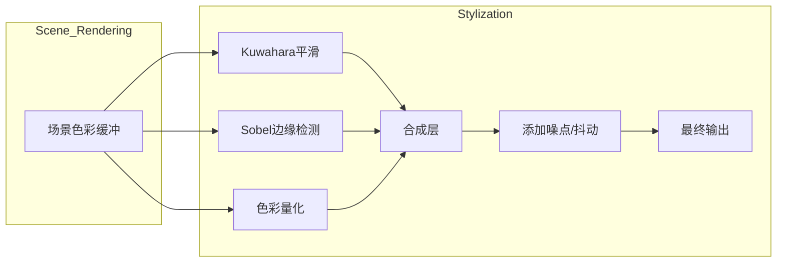

# 执行摘要

桑原滤镜（通常指**Kuwahara**滤镜）是一种保留边缘的艺术化平滑滤镜，对图像进行油画/水彩化处理【18†L322-L331】【16†L125-L132】。它将图像分区并选取方差最低区域的平均色进行替换，从而保留边缘细节。我们还将介绍基于边缘检测（Sobel/Canny）提取轮廓、色彩量化（Posterize）处理、线稿混合和噪声纹理等变体。这些滤镜在URP中一般通过**全屏通道后处理**实现，可使用Shader Graph（Fullscreen Pass）或编写自定义Render Feature/Volume组件来完成【35†L32-L41】【42†L49-L57】。为了方便艺术家使用，应设计可交互的参数（如半径、阈值、色级数量、线条粗细、噪声强度等）及直观控件（滑条、颜色选取、开关、预设等），并提供合理的默认值与范围。我们将比较各种变体的优缺点与适用场景，并给出完整的参数表和UI建议（表格形式）。同时讨论UI布局及预设管理、性能开销（移动端/PC/主机）、与其他后处理叠加的注意事项。最后列出开源参考实现（代码链接）及调试建议，并给出**简洁/平衡/高质量**三个不同方案的实现步骤与性能预估。

## 滤镜原理与变体

| 滤镜变体        | 优点                                        | 缺点                                           | 适用场景                                      | 主要可调参数（默认/建议范围）                              |
|-----------------|---------------------------------------------|----------------------------------------------|---------------------------------------------|--------------------------------------------------------|
| **原始桑原滤镜**（Kuwahara）  | 平滑图像同时保留边缘，呈现绘画感效果【18†L322-L331】；适用于生成油画或水彩效果【18†L328-L331】。 | 算法复杂度高，特别是大半径时耗时长【37†L174-L182】；容易产生方块伪影【18†L362-L370】；对移动设备负载大。 | 场景纹理较多、需要整体绘画感时，如卡通化场景、过场CG。           | 采样半径（Radius，默认3，可调1–10）；迭代次数（如果支持多通道或多尺度，一般默认1）；混合强度（Mix，将原图与滤镜结果插值，默认1）；控制滤镜强度的滑条。 |
| **边缘检测滤镜**（Sobel/Canny） | 提取场景轮廓，线条清晰；算法简单、高效；常用于描边轮廓、风格化线框【16†L100-L107】。 | 仅保留边缘信息，原始颜色/纹理丢失；可能需要额外组合原图；对细节噪声敏感。 | 卡通化、插画风格，高对比场景；也可作为其它滤镜（如Kuwahara）的叠加层用于突出边缘。 | 阈值（Threshold，边缘检测灵敏度，默认0.1, 范围0–1）；边缘颜色（Edge Color，默认为黑）；线宽（Thickness，默认1，可调0.5–3）；可选“深度+法线”通道切换。 |
| **色彩量化滤镜**（Posterize） | 降低颜色级数，产生平坦的色块和噪点风格【24†L18-L26】【16†L141-L144】；实现简单、开销低。 | 过度量化可产生明显条带；无边缘增强效果；需要配合噪点或抖动避免色带问题。 | 用于模拟插画、点彩、复古风格；与卡通渲染组合效果佳。 | 色阶数（Levels，默认8，可调2–32）；灰度模式开关；抖动（Dither）强度（0–1，可选使用Bayer或蓝噪声纹理）；平滑过渡参数（如亮度阈值）。 |
| **线稿混合滤镜**（Toon/Sketch） | 结合轮廓线和原始色彩，可生成漫画风格（粗黑线+平面色）【16†L120-L127】【16†L141-L144】；艺术效果明显。 | 实现相对复杂：需先抽取线条再与色块合成；线条质量依赖边缘检测；参数过多时调整费力。 | 漫画、卡通渲染效果；搭配色彩量化可产生典型的“卡通涂色”外观。 | 线条颜色（Line Color，默认黑）；线条强度/浓度（Blend，0–1）；阈值（Threshold，控制线条提取灵敏度）；色彩量化级数；混合模式（覆盖或叠加）。 |
| **噪声纹理滤镜**（Dither/Noise） | 添加噪点或交错图案，增加质感和随机性；可缓解色带和方块伪影【29†L129-L134】；模拟绘画颗粒感。 | 增加随机性，有时会破坏纯净度；可能引入多余细节；过强噪点看起来混乱。 | 用于增强水彩/粉彩效果、模拟传统媒介纹理；与Kuwahara或Posterize组合降低失真。 | 噪声强度（Intensity，默认0.1，可调0–0.5）；噪声类型（Uniform/Gaussian/蓝噪声）；噪声缩放（Scale）；可选阈值抖动开关。 |

上述变体中，**原始桑原滤镜**通过在多个子窗口中取最小方差区域的平均值来平滑图像【18†L322-L331】（示意图见下）。**边缘检测变体**（如Sobel）可快速获取白边黑纹的效果【16†L100-L107】。**色彩量化**即对颜色进行离散化处理，Unity Shader Graph中可用Posterize节点实现【24†L18-L26】；常结合抖动（Dither）避免条带。**线稿混合变体**则先生成黑白线稿（如Toon滤镜的粗黑描边【16†L120-L127】），再与原色或其他着色相混合，形成卡通上色效果。**噪声纹理变体**类似于图像抖动，通过有序抖动或噪点增加颗粒感【29†L129-L134】。

【31†embed_image】*图1：应用基础Kuwahara滤镜后的示例效果（Simple 模式）【45†L293-L300】。*

## URP实现策略

在Unity URP中，常见的后处理滤镜实现方式包括：**Shader Graph 全屏通道**、**自定义Render Feature/Pass**（C# + HLSL）以及**Compute Shader**（较少用于屏幕滤镜）。Unity官方提供了两种推荐方式：

- **Shader Graph 全屏着色器**：创建一个“Full Screen Shader Graph”并使用“URP Sample Buffer (BlitSource)”节点获取渲染后的场景颜色【35†L32-L41】。构建完成后，新建一个材质并赋予该Shader，再在Pipeline的Renderer中添加一个**Full Screen Pass Renderer Feature**，将材质设置到该特征的Pass Material，中途注入点选择“After Rendering Post Processing”或“Before Rendering Post Processing”【35†L87-L94】。这种方式无需编写C#脚本，适合快速原型或无需复杂交互的滤镜。

- **自定义Render Feature+Volume**：使用URP内置模板（Assets → Create → Rendering → URP Post-processing Effect (Renderer Feature with Volume)）生成脚本框架【42†L49-L57】。在生成的Renderer Feature脚本中编写`ScriptableRenderPass`以执行全屏绘制逻辑，同时在对应的Volume Component脚本中定义参数，供场景卷（Volume）控制器修改【42†L49-L57】。模板示例中已包含反色效果，可以改为实现桑原或其它滤镜功能。通过这种方式，滤镜参数可以在场景中通过Volume进行Blend和动画控制，更方便与URP的体积系统集成。

- **Shader Graph/Compute Shader**：若滤镜计算量极大，可考虑使用Compute Shader进行预处理（例如生成噪声图或大卷积核）。然后在后处理Pass中通过Compute计算结果。但一般桑原滤镜多为全屏逐像素操作，可直接在常规Pass中实现。

以上实现都可与URP原有的后处理系统（如Bloom、色阶等）协同工作。一般建议将自定义滤镜置于内置后处理之后应用【35†L87-L94】，以免出现不期望的效果交叠问题（例如在Bloom后再Posterize会抹去高光变化）。注意如果滤镜使用深度或法线信息，需要在Pass中手动采样相应的G-Buffer或额外RT。

## 艺术家友好的参数设计与UI布局

为了让艺术家易用，各参数需取有意义的语义名称、提供说明提示，并使用适当的交互控件：

- **滑条（Slider）**：用于连续数值，如Kuwahara的半径（1–10）、边缘阈值（0–1）、色阶数（2–32）、噪声强度（0–1）等。【24†L38-L40】可参考代码实现Posterize。默认值应处于中间或常用范围（如色阶8、阈值0.1）。滑条旁可显示数值实时反馈，并支持关键帧动画。

- **颜色选择器（Color Picker）**：边缘颜色、线条颜色、背景色等参数使用色轮选择。可提供色环+饱和度滑块界面。默认黑色或白色，根据常见卡通效果设定。

- **切换开关（Toggle）**：启用/禁用子效果。如“启用线稿（Outline）”、“启用抖动（Dither）”、“启用噪声”、“使用深度边缘”等布尔选项。方便快速开关调试。

- **预设下拉菜单（Dropdown/Enum）**：如噪声类型（Uniform、Gaussian、BlueNoise）、边缘算法（Sobel/Canny/Prewitt）、混合模式（叠加/覆盖），可用枚举选项。给出合理默认并注明效果差异。

- **遮罩和混合控制**：对Kuwahara等滤镜，可提供原图与滤镜结果的混合强度（Blend 或 Weight），默认1（全滤镜），范围0–1。配合参数可以部分显示原始细节。

参数应分组排列，例如“边缘参数”、“色彩参数”、“效果开关”等，使界面清晰。可以添加工具提示或说明文字，帮助理解语义。**预设管理**方面，可参考Unity PostProcessing包的做法，允许艺术家保存不同参数集合为Preset，快速切换场景风格。

## 性能与兼容性

- **性能影响**：桑原滤镜采样众多子窗口，GPU开销大，尤其在高分辨率或大半径时极慢【37†L174-L182】。移动端上，一个像素需计算多次均值和方差，容易超时崩溃【37†L174-L182】。若目标设备较弱，应限制半径或使用固定半径版本优化。相对而言，**边缘检测**（3×3卷积）和**色彩量化**（简单四舍五入/抖动）算力低，适合实时使用。**线稿混合**需要额外二次Pass，但算法复杂度依赖边缘检测与图像叠加，属中等开销。**噪声/抖动**可采用阈值映射或查表快速实现，开销中等。

  - *移动端*：建议最大分辨率、半径和迭代次数都较低（如512~1024分辨率、半径≤5）。可提供分辨率缩放选项（如半分辨率处理）以提高帧率。
  - *PC/主机*：允许更高的质量（大分辨率、大半径、多通道采样），但仍要控制在目标帧率内。使用异步Compute或多线程可缓解卡顿。
  - *多通道叠加*：注意额外的RenderTexture会占用内存。如同时开启多个效果，可尝试共享RT或按需激活，以免过度占用GPU内存。

- **兼容性**：上述滤镜可与Bloom、Color Grading等其它后处理叠加。为了不被Bloom虚化效果削弱，可将Kuwahara置于Bloom之前或之后视需求而定。若开启Outline类效果，通常要在后面叠加（如在Kuwahara或Color Grading之后绘制纯线稿）。使用URP Volume系统时，应合理设置权重Blend和注入时机，避免颜色空间（线性/sRGB）转换错误。检查滤镜与后期HDR、Gamma的兼容性，必要时在线程中进行颜色空间转换。

## Mermaid流程示意

以下示意图描述了一个典型的风格化后处理管线：原始场景渲染完成后，图像先后经过平滑、边缘和量化等滤镜，再组合叠加噪声，最终输出画面。请注意各个处理节点可能根据具体实现调整顺序和传入输入。



## 参考实现与代码片段

- **开源实现**：例如Mikhail Gorobets的URP实现（TxN/UnityURP_Kuwahara）提供了基本、广义和各向异性Kuwahara效果【45†L293-L300】；GarrettGunnell的Post-Processing仓库也包含多种Kuwahara滤镜变体及Ordered Dithering实例【28†L490-L498】【28†L523-L531】。GPUImage库中有Toon滤镜（粗线描边）和Posterize滤镜的实现，可作为原理参考【16†L120-L127】【16†L141-L144】。

- **Shader Graph示例**：Unity官方文档提供了创建全屏Shader Graph后处理的教程【35†L32-L41】【35†L87-L94】。例如，使用URP Sample Buffer获取场景颜色，并在片段函数中应用Posterize节点（`Out = floor(In*(Steps)) / Steps`）即可实现色彩量化【24†L38-L40】；边缘检测可通过采样周围像素并应用Sobel卷积核得到，示例代码如下（伪代码）：
  ```hlsl
  float3 SobelEdge(float2 uv) {
      float4 c00 = SAMPLE_TEXTURE(_MainTex, uv + float2(-1,-1));
      // ... 同理采样其他8个邻域像素 ...
      float gx = c00.r + 2*c10.r + c20.r - (c02.r + 2*c12.r + c22.r);
      float gy = c00.r + 2*c01.r + c02.r - (c20.r + 2*c21.r + c22.r);
      float edge = sqrt(gx*gx + gy*gy);
      return float3(edge, edge, edge);
  }
  ```
  类似地，Kuwahara滤镜可以在Compute或像素着色器中分别采样四个子区域并取最小方差区域的平均色【18†L322-L331】。完整实现可参考Unity Shader Graph官方文档或上述开源项目。

## 参数总表与UI控件建议

| 参数名        | 默认值      | 建议范围           | 推荐控件及说明                                                     |
|---------------|------------|--------------------|------------------------------------------------------------------|
| **Radius**（半径）  | 3          | 1 ~ 10（整数）      | 滑条：控制Kuwahara滤镜采样半径，值越大平滑效果越强，但成本高。             |
| **Intensity**（强度）| 1.0        | 0.0 ~ 1.0          | 滑条：滤镜混合强度（0-原图，1-全滤镜效果）。                                 |
| **EdgeThreshold**（边缘阈值）| 0.1        | 0.0 ~ 1.0          | 滑条：Sobel/Canny阈值，值越低边缘越多；配合颜色选择器定义边缘颜色。              |
| **EdgeColor**（边缘色） | 黑色       | N/A                | 颜色选择器：定义轮廓线颜色。                                             |
| **Levels**（色阶数） | 8          | 2 ~ 32（整数）      | 滑条：Posterize节点的级数；级数越低，颜色块越平坦，可搭配抖动开关使用【24†L18-L26】。|
| **DitherEnabled**（抖动）| Off        | 开/关              | 开关：是否启用有序抖动（Bayer矩阵等）来减少条带【29†L129-L134】。            |
| **NoiseIntensity**（噪点强度）| 0.1        | 0.0 ~ 0.5          | 滑条：叠加噪声或抖动的强度，用于模仿画布纹理或减少量化伪影。                   |
| **OutlineWidth**（线宽）| 1.0        | 0.5 ~ 3.0          | 滑条：Toon滤镜或线稿宽度，值越大线条越粗。                                 |
| **OutlineColor**（线稿色） | 黑色       | N/A                | 颜色选择器：卡通轮廓颜色。                                             |
| **BlendMode**（混合模式）| Additive   | Normal/Additive/etc.| 下拉：选择叠加方式，如线稿与原图的合成模式。                                |

## 可直接实现的三个方案

1. **方案1 – 简洁（低成本）**  
   - **步骤**：只实现基础边缘检测或基础Kuwahara。可用Shader Graph中的Sample Texture（场景色彩）→ Posterize节点与Dither节点链入片段着色器，或使用内置Sobel卷积。无需Volume集成，只做全屏Pass即可。  
   - **性能**：非常轻量（单次3×3采样或简单色彩量化），适合移动端和低配PC。略微影响帧率，基础滤镜实时可用。  
   - **用途**：适合快速调试或对性能要求高的场景；效果简单直接，主要侧重轮廓或色块风格。  

2. **方案2 – 平衡（中等质量）**  
   - **步骤**：加入Kuwahara平滑＋边缘叠加＋可选抖动。实现Full Screen Pass，将Kuwahara平滑输出与Sobel边缘图（阈值提取黑白线）叠加，再通过Posterize处理色彩，最后混入轻量噪点。可利用URP Volume模板以支持运行时参数调整。  
   - **性能**：中等开销。Kuwahara半径和迭代可适中（如3×3区域），Sobel和Posterize成本低。预计适用于大多数PC和主机（30–60 FPS），移动端需降分辨率。  
   - **用途**：生成较完整的艺术风格，适用于需要较好图像质量且对性能有一定余量的项目。  

3. **方案3 – 高质量（重效果）**  
   - **步骤**：使用**各向异性Kuwahara**或**Adaptive Kuwahara**滤镜【20†L401-L410】最大化保边和抽象效果，同时叠加高精度抖动（蓝噪声）、复杂的线稿（多次边缘检测或多级阈值线）和色彩查找表（LUT）色调。可能分多通道处理，并使用Compute Shader优化大卷积。集成到URP Volume，可实时混合调整。  
   - **性能**：开销最大，适合高端PC/主机。可能需要牺牲渲染分辨率或帧率来保证质量。推荐仅在预渲染或次世代硬件使用。  
   - **用途**：追求极致艺术效果时使用，适合渲染电影级NPR画面或高品质截图。

以上方案可根据项目需求选择：**简洁方案**追求实时与可控；**平衡方案**兼顾效果与性能；**高质量方案**追求艺术表现极致。每种实现都应在不同设备上进行性能测试并调整参数。

**参考资料**：以上内容参考了Unity官方文档【35†L32-L41】【42†L49-L57】、Wikipeida和学术资料【18†L322-L331】【20†L383-L392】、GPUImage滤镜列表【16†L120-L127】【16†L141-L144】及开源项目示例【45†L293-L300】【28†L490-L498】等。