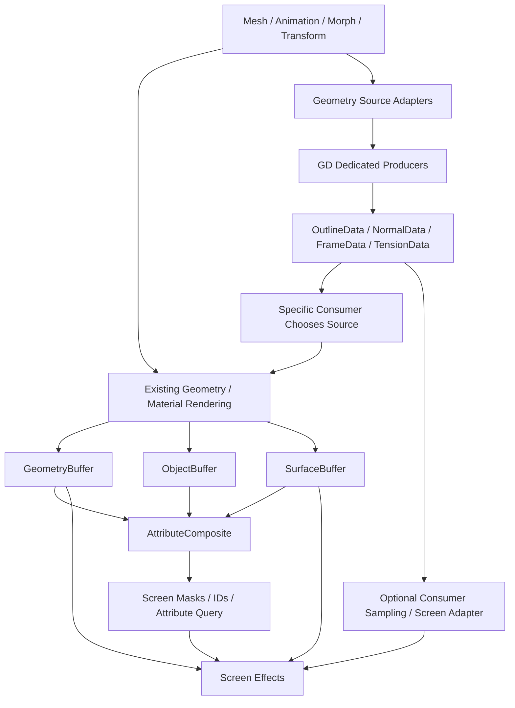

# Ho-GeometryData 分层架构与实施规划

日期：2026-10-04。状态：分层规划；ReferenceFrame 与 OutlineCorrection 首版已实现，后续模块仍为规划。面向本地 Unity 6 / HoUrp17.3.0 / lilToon。

研究依据见 [业内分层调查](Ho-GeometryData-Industry-Research.md)。本文按本轮用户校正重新收敛：组件显式触发、专用数据生产、消费者自主选择、相机参数独立。旧稿中的统一属性覆盖链与默认导入 bake 不再采用。

## 1. 定位与本轮决策

**GD 是专用几何数据生产层。** 各模块生产自己的完整结果，提供稳定的查询与资源接口；共用基础设施处理来源读取、资源寿命和 GPU 调度。

GD 不做通用属性中控台，不维护一个“最终 Normal / UV / Position”的全局命名空间，也不替消费者裁决数据源。

1. 功能通过挂到对象上的生产组件使用：描边修正、法线修正、参考系、张力各有入口。
2. 每个模块拥有专用输出。消费者明确选择某个模块的结果，不按组件次序让后一份覆盖前一份。
3. 跨效果共用的数据由一个共享模块完整生产，各效果复用同一份结果。共用不通过覆盖链实现。
4. Static / Dynamic 表示更新与复用方式，与初始化、Play 前、手动触发以及相机依赖分别描述。
5. 描边 bake 由组件触发，不默认挂到模型资产导入流程。
6. 法线修正独立输出专用 normal 数据，shader/效果决定如何使用；首版不写回原始 Mesh 或 Unity 持有的蒙皮 buffer。
7. UV 暂只保留扩展契约；没有真实使用场景前，不实现 UV 覆盖模块和控制面板。
8. 参考系可以是 Dynamic；相机作为求值参数。首版不继续维护每相机 yaw/pitch 结果表。
9. 调度负责数据何时有效及 GPU 依赖，不负责“哪个效果应当赢”。

所有能力仍需经过来源、索引和时序验证；生产包尚未加入 GD 运行时实现。独立 research 原型与验证记录见下方实施优先级及本地报告，不等同于生产迁移已经完成。

**实施优先级校正**：第一步将 OB 持有的朝向参考迁入 GD，并保证既有眼透调用正常；第二步移植本机 Blender 4.5 HoTools 的 RGBA 描边方向/厚度修正，给 lilToon 增加一个修正来源模式；第三步才是 Tension 与 lilToon 皮肤褶皱组分。独立法线代理、UV、模拟等后续需求不能阻塞这三步。验证原型保存在 Git 本地忽略、Unity 不导入的 `research~/GeometryData/`，不先进入生产 Runtime/Editor。

**验证进度（2026-10-04）**：第一步隔离原型在 Unity 6000.3.15f1 / D3D11 通过 360 组 CPU 与 228 次 GPU 对照，并通过真实 GB/OB/AC/角色特化的双相机、动态朝向、清空 OB 朝向与禁用回退检查。第二步已从本机 Blender 4.5.8 HoTools 生成 6 组参考并通过独立算法数值对照；Unity 描边模块、新来源模式和真实角色仍未验收。详情保存在本地 `research~/GeometryData/README.md` 与 `Results/`，不提交验证产物。

## 2. 与 GB、OB、SB、AC 的关系

**目标 AC 消费 GB + OB + SB，生产屏幕后处理所需的遮罩与 ID。** 这一扩展尚未开始实现；当前 OB/SB 实现范围不能作为 AC 的长期边界。



图表示职责与可选消费关系，不意味着这些节点已实现或必须按某条固定串行链执行。

- GB/SB 提供下游原有的通用屏幕几何/表面来源。GD 提供专用几何结果，两者可成为具体效果的不同候选来源。
- 是否采用 GD 法线，是否继续采用 GB/SB 来源，由消费者决定。GD 不把自己的数据设成更高优先级，也不自动覆盖 GB。
- 普通下游继续消费 GB/SB/AC，不需要为一个法线修正模块审计或重写所有其他 Feature 的选择策略。
- 若某个材质/绘制消费者选择 GD 修正，其最终光栅结果可以进入 GB/SB；该接入由消费者实现。
- 若屏幕效果直接需要 GD 数据，要有明确的顶点/表面采样或屏幕适配。逐顶点 buffer 与 GB 屏幕纹理不是可直接交换的资源类型。
- 屏幕遮罩和 ID 的组合由 AC 负责；GD 不另造一套屏幕后处理遮罩中控台。

## 3. 功能组件与专用输出

以下名字均为暂定 API，不表示已经存在。

| 组件 / 模块 | 负责生产 | 典型消费者 |
| --- | --- | --- |
| HoOutlineCorrection | OutlineDirection + WidthCorrection，作为一份完整 OutlineData | 外扩描边、选择接入的描边视觉 pass |
| HoNormalCorrection | CorrectedNormal / FaceNormalData | 指定材质、需要此候选法线的特定效果 |
| HoReferenceFrame | HeadFrame / BoneFrame / ObjectFrame | 面部材质、眼透角度、方向相关效果 |
| HoTension | 长度/面积/角变化与专用 TensionData | 皮肤、皱纹、布料材质或 FX |
| SharedTriangleGeometry | 当前三角面积、几何法线、角点数据 | 真正需要相同基础量的多个生产模块 |
| SharedTopology | mesh/LOD 邻接、索引及连接描述 | 需要邻接的模块 |

组件指定目标 Renderer、来源、参数、可选共享 Profile、触发方式和输出需求。GD 基础绑定/资源注册可由组件自动办理，不要求用户再为每个功能手动挂一层管理器。

Profile 是可复用预设，不替代组件上的启用、对象目标和触发控制。组件不自行任意 Dispatch；GPU 工作通过来源和调度适配器进入正确执行时机。

### 3.1 专人专用，不建立覆盖规则

每个模块具有自己的有类型输出，例如 `HoOutlineData`、`HoNormalData`、`HoFrameData`、`HoTensionData`。它们的方向、向量或标量可能具有相同存储类型，但不因都叫 normal/float3 就共用一个可被覆写的输出槽。

若两个组件发布了不同数据，两份数据保留各自身份，消费者引用需要的那一份。GD 不按照组件顺序、优先级或 Static/Dynamic 类别替消费者选择。

模块内部的完整算法可以包含多个步骤，例如 NormalCorrection 的代理求值、区域处理与方向计算，但只对外发布该模块完成后的结果。这里不设计让多个独立效果依次接管同一个通用 normal 的堆叠链。

### 3.2 跨效果共用的结果由共同模块生产

描边与张力都需要 TriangleGeometry 时，由共享模块一次生产，各自读取；头部参考系被几个效果使用时，由 ReferenceFrame 模块发布同一份参考系。

如果多个效果确实需要一种共同的“修正方向”，应建立明确的共享生产模块，统一其定义、输入与求值方式，再供它们使用。GD 不把效果 A 输出当成效果 B 的隐式覆盖底座。

每个模块内部可以有明确的多步 GPU 子管线。资源读写依赖交给现有 RenderGraph；不另做通用属性解析器、覆盖优先级编辑器或全局属性编译器。

## 4. 输出契约与共用基础设施

每份输出需要描述以下信息，而不需要加入全局属性字典：

| 信息 | 示例 | 作用 |
| --- | --- | --- |
| Output type / owner | HoNormalData，某个 NormalCorrection 实例 | 明确是谁生产的哪份结果 |
| Domain | Instance、RenderVertex、Edge、Triangle、Corner、SamplePoint | 数量与索引空间 |
| Value role / space | normal、direction、frame；RendererLocal / World / ProxyLocal | 正确转换和采样 |
| Update class | Static / Dynamic | 结果何时可以复用 |
| Trigger policy | Initialize、BeforePlay、Manual、OnSourceSample | 何时提出生产请求 |
| View dependency | None 或显式视图依赖 | 是否使用相机参数 |
| Revision / sample | Source、Bake、Parameter、LOD、Sample revision | 缓存与失效判断 |
| Validity / history | Valid、Pending、Stale、Invalid；previous sample | 区分无值、合法零与历史 |
| GPU resources | buffer、offset、count、layout | 调度与消费者正确访问 |

名字/组件引用在 CPU 注册时解析。GPU 热路径使用有类型 helper 和固定的模块契约，不逐顶点搜索字符串字段。

共用基础设施只负责：来源适配、模块注册、必要的共享缓存、GPU 内存寿命、调度、访问索引和诊断。它不决定法线、UV 或方向场最终应采用哪个效果。

一个 mesh 可以被多个对象复用。拓扑可共享；不同 pose、组件参数、参考姿势或 mask 的结果不因 mesh GUID 相同就自动共享。

## 5. 描边 bake 的触发与缓存

**Static 不意味着资产导入时生成。** 对象上的 HoOutlineCorrection 可以显式生产并缓存自己的方向和厚度修正。

### 5.1 触发入口

| 入口 | 行为 | 约束 |
| --- | --- | --- |
| 组件/实例初始化 | 按组件设置请求一次准备与 bake | 有匹配结果可复用；重新启用不无条件重复 |
| 进入 Play 前 | 对启用了此策略的对象准备与生产 | 明确采样姿势；与 Play 内初始化去重 |
| 手动按钮 / API | “生成/更新修正”，可随时显式重建 | 发布新的 BakeRevision，不修改原始 mesh |
| 按 pose sample 更新 | 用户选择动态重算时运行 | 多相机不重复基础求值 |

Initialize 和 BeforePlay 是可选自动触发策略，Manual 始终可用。OnEnable 先注册/提出请求；来源未 ready 时进入 Pending，不能当场读无效 GPU buffer。

请求流程是 `Request → Prepare → Execute → Validate → Publish`。只有整份输出完成后才对消费者发布新版本，旧资源寿命覆盖仍在执行的绘制。这里的版本替换是同一个模块更新自己的结果，不是不同模块相互覆盖。

需要 GPU 的模式由调度器执行；编辑器手动/Play 前触发没有有效 GPU 上下文时，可以使用一次 CPU 求值，或明确报告等待/失败。不能把进入 Play 后第一次执行伪称为 Play 前已完成。

### 5.2 缓存与可选持久化

Topology、Adjacency 等基础数据在组件 Prepare 阶段按需求构建，可跨实例复用。可选离线预建只是优化初始化成本，不自动执行场景中的艺术修正。

描边输出的缓存 key 包含 mesh/LOD 内容、组件参数、mask、参考状态与算法版本。重导入/参数变更标记 Stale；是否重建由组件触发策略决定，手动模式不悄悄重新 bake。

结果默认由对象的 GD 资源 owner 持有。保存为缓存资产是可选显式操作，不是功能使用的前提，也不默认写回 sharedMesh。域重载或进入 Play 后，能加载缓存则加载，否则按组件策略重新准备。

### 5.3 bake 与运行时姿势适配分别定义

一次 bake 可以建立参考方向、厚度修正、OutlineWeldGroups 和参考状态。对于会蒙皮或 morph 的对象，不能将参考姿势方向不经变换直接当作当前方向。

组件可选择：参考结果随来源进行姿势适配，或根据当前几何重算；动态求值仍属于同一个 OutlineCorrection 模块，不构成另一效果覆写它。首轮先验证当前几何重算路径，再按实际需求实现参考方向输运。

焊接组按视觉壳关系建立，检查部件、蒙皮权重与 morph 轨迹，不能仅因 bind pose 同位置就把眼球/眼睑、唇内/唇外等永久连在一起。

OutlineData 同时发布方向与厚度修正。修正的单位/含义需固定：首版建议 WidthFactor 为无量纲因子，默认 1；最终 `_OutlineWidth`、mask、像素宽度或投影修正由描边消费者决定。GD 不代替消费者合成最终材质宽度。

**本机算法优先于上述泛化候选**：实际移植以 HoTools `VertexColorTools/bake_normal.py` 的 `SOLIDIFY_RAW2SMOOTH` 为基准。RGB 是 TBN 编码的方向，A 以 0.5 为中性值编码带曲率符号的 shell 补偿。它不能直接改名成 WidthFactor=1。GD 可以发布对象空间方向并保留等价补偿参数，lilToon 新增专用来源模式；旧顶点色来源和既有材质值保持兼容。当前仓库的 RGBA 路径直接使用 `color.a` 乘宽度，需要对照确认旧消费语义，再决定新模式的准确解码，不能擅自改成不同效果。

## 6. 法线修正组件

HoNormalCorrection 挂在对象上，选择目标 Renderer、参考系、解析圆柱或真实代理面，输出该组件自己的 CorrectedNormal。数据可以 Static bake，也可以按表情/pose 动态生产。

**首版独立存储，由 shader 或具体效果选择消费。** 消费者可以将它直接作为自己的通用 normal 输入，不要求材质其他逻辑继续区分来源；这个选择发生在消费者中。

GD 不写回 sharedMesh.normals，也不修改 Unity 持有的 skinned normal buffer。这样同资产其他实例和原生 mesh 查询不被改动；Mesh.normals 等 CPU 查询仍返回原始数据，需要专用修正结果的系统通过模块接口读取。

这里不设计其他 Feature 应该选哪种 normal。正常下游仍读取 GB/SB 的产物；专门接入此组件的消费者自行选择专用结果。GD 的 CorrectedNormal 与 GB 的屏幕法线可作为某个效果的不同候选来源，不建立 GD 优先于 GB 的规则。

### 6.1 解析圆柱

配置 CylinderFrame、轴、中心、半径/椭圆截面、区域和参数。当前点转到 ProxyLocal，计算侧面方向，再按法线空间转换发布。

圆柱示意：`radial = p-center-axis*dot(p-center,axis)`。零半径需要有效性处理；椭圆/非均匀缩放使用相应隐式面梯度与法线变换，不直接把普通径向方向当成椭圆法线。

当前位置驱动与固定 proxy/bind 坐标驱动表达不同美术效果，组件明确选择。简单解析场可通过模块共用 HLSL 在顶点求值；需要其他 GPU 系统复用时再物化 buffer。

### 6.2 真实代理面传递

通过组件初始化、Play 前或手动建立 BindingData：目标顶点 → 源三角/参数坐标、重心坐标/偏移、版本与质量标志。绑定缓存可显式保存，但不依赖默认资产导入处理。

运行时沿固定绑定求值，读取代理当前 normal 并发布完整 NormalData；每帧最近点搜索不是默认路径。动态投影/滑动绑定需要时由本模块另设策略。[Unity SkinAttachment 实现参照](https://github.com/Unity-Technologies/com.unity.demoteam.digital-human/blob/master/Runtime/SkinAttachmentTarget.cs)。

区域处理、参数化或代理算法由此模块完整完成，不通过多个 normal producer 的公开覆盖链搭积木。实际脸部表情、高光与 normalmap 行为由接入的材质验证；需要 TBN 的消费者处理自己的切线/法线接口。

## 7. UV 暂缓

目前没有明确使用场景，首版不实现 UV 改写、UV 覆盖组件或原生 mesh 写回。只保留将来发布专用 HoUvData 的扩展可能。

出现真实需求后，组件发布自己的坐标结果，消费者明确选择用于哪些贴图/采样；不自动替换所有 UV0/UV1。alpha clip、normalmap、lightmap、不同 pass 的 UV 用途是否随之变化，由该消费者的接入设计决定。

这保留后续自由度，同时不在 GD 引入目前用不到的通用属性覆盖机制。

## 8. Dynamic 参考系与相机参数

HoReferenceFrame 将骨骼/Transform 与轴定义转换成模块自己的动态 HeadFrame / ObjectFrame。可以延续现有有效的打包方式，把打包和解码收进该模块的契约，不要求为了 GD 改名而换一套表示。

世界参考系由 pose/Transform 更新；相机只是使用这份参考系的求值参数。**Dynamic 描述数据随时间更新，不要求它按相机再存一份。**

### 8.1 不继续默认生产每相机角度表

当前 HoCharacterEyeAngleTable 为每相机保存组级 yaw/pitch。新的默认消费方式是：

```text
Dynamic HeadFrame + current ViewContext
    -> consumer computes yaw / pitch / angle factor
    -> effect result
```

把角度计算做成共用函数，材质、屏幕效果或 CPU 消费者可在自己的消费位置调用；不默认创建每相机 yaw/pitch 纹理。组级原点、轴方向、角度范围和软化响应应与现有行为对照验证。

取消的是预先存储“该角色对该相机的角度结果”的表。多个角色仍需找到各自的 HeadFrame：材质用 draw-local 关联，屏幕效果用 AC 身份关联。这个基础寻址可以是 buffer 索引，也可在合适绘制中直接绑定；Dynamic 不会令多角色的实例归属自动消失。

即时 shader 求值是默认设计，不宣称一定比小型结果表更快。若真实 profiler 显示屏幕逐像素计算成本过高，可由具体消费者决定缓存自己的 view-dependent 结果；这不是 GD 的默认要求或统一角度生产机制。

### 8.2 相机是独立参数，不是公共几何状态

ViewContext 至少描述当前视图的位置/方向、投影类型、必要矩阵、viewport/目标尺寸、视图调用标识与 XR eye 信息。GPU 参数在记录本次绘制/dispatch 时捕获，不能延迟读取一个随后被其他相机修改的 Camera 对象或全局变量。

Perspective 的方向可以来自 cameraPosition - frameOrigin；Orthographic 通常需要视图方向，不能无条件沿用透视公式。XR 按选定策略使用逐眼或明确的共享中心参考，不能在单次多眼绘制里只传一个未定义来源的 cameraPosition。

每个使用相机的模块/消费者声明自己的参考：当前渲染视图或指定观察视图。反射、角色捕获、Scene View 与录制相机分别使用正确参数，不默认绑定 Camera.main。

本地 URP 的相机属性设置会更新全局相机参数；GD 早期生产入口可能早于这些设置。因此基础无相机任务不读取相机全局，相机相关任务必须显式获得自己的 ViewContext。

### 8.3 模块级相机依赖

| 数据 / 求值 | 是否依赖视图 | 首轮方式 |
| --- | --- | --- |
| 原始拓扑、参考 bake | 默认不依赖 | 初始化/手动生产并复用 |
| Tension、基础 OutlineDirection | 默认不依赖 | 按来源 sample 更新 |
| HeadFrame / ObjectFrame | 不依赖 | 动态参考系，每 pose/Transform sample 一份 |
| 参考系相对视角 | 依赖 | 在消费者中以 ViewContext 即时计算 |
| 描边屏幕宽度 / 投影修正 | 依赖 | 描边消费者处理 |
| 用户选择的 view-dependent normal 算法 | 依赖 | 本模块显式 view 求值或独立 view-local 输出 |

相机相关结果不能写回公共基础输出。真正需要缓存 view-local GPU 结果时，由所属模块/消费者拥有独立资源，key 包含基础版本、本次 ViewInvocation、投影/尺寸/eye；同一个 Camera 对象可能在不同调用中使用不同参数。

## 9. 样本、缓存、LOD 与历史

公共基础结果按对象/模块、SourceSampleId、mesh/LOD、参数/参考状态版本复用。首个需要它的渲染流程执行，后续相机复用；相机依赖求值另行处理，不再推进一次 pose 或模拟历史。

普通 SMR 没有给 GD 暴露通用 GPU pose revision。首版按已验证的渲染样本边界保守建立 SampleId，mesh/配置变更递增 epoch；手动动画和录制子样本提供显式更新入口。编号是 Ho 调度标识，不能作为 native skinning 已完成的证据。

Static 手动结果在重建/失效前复用。Dynamic 结果随来源 sample 更新。域重载、禁用恢复、Enter Play Mode 设置、场景卸载与 GPU 资源重建都要恢复正确有效性，不能残留旧全局绑定。

native previous、模块自己的 previous output 与 solver history 分开。历史每样本提交一次，不按每相机推进。首次启用、瞬移、mesh/LOD 切换或不兼容参考状态更新时显式重置历史。

动态描边方向/厚度改变壳位置时，描边消费者的 previous 位移需要 previous OutlineData 或可重建历史；不能 current/previous 都套当前方向。此项由 OutlineCorrection 与它的描边接入共同完成。

LOD 有自己的 topology/rest/索引。默认跨 LOD 历史失效；多个视图要求不同 LOD 时，不改写仍被其他视图引用的结果。离屏/无相机状态是否更新受来源设置限制，应显示 Frozen / Invalid / Updated。

## 10. Tension 专用模块

HoTension 通过组件初始化、Play 前或手动操作建立参考状态，之后按当前来源 sample 计算。基准可选择 mesh 原始姿势或当前 pose，参考捕获触发与逐帧求值分开。

首轮保留用户三个输入：边长变化、三角面积变化、角点两边夹角变化。若原 Blender 算法实际采用跨面二面角，再在本模块中明确对应，不将二者混同。

基准包含 Edge 的顶点对/rest length、Triangle 的顶点三元组/rest area、Corner 的有序边对/rest angle，以及必要的 CSR。参考与当前位置统一度量空间，刚体放置不产生 strain；整体缩放语义由本模块定义。

建议测量采用零中性值：

```text
edge strain  = log(currentLength / restLength)
area strain  = log(currentArea / restArea)
angle change = (currentAngle - restAngle) / pi
```

这些公式是本项目候选响应，不是物理应力模型。角度采用差值，避免零基准除法；退化边/面、NaN/Inf 与尺度相关 epsilon 在本模块处理。

先保留拉伸/压缩/角变化，再用本模块自己的权重、曲线和区域定义生产完整 TensionData。不同符号变化不先相互抵消。模块内部的组合不是多个效果对共享属性的覆盖。

GPU 子管线可为 Extract → Triangle/Edge Metrics → CSR VertexGather → Response/Filter。共享 TriangleGeometry 确实相同时复用；每顶点 gather 避免多 primitive 线程竞争写同一顶点。材质通常按 vertex 取值后插值；需要 UV texture 或屏幕结果时，由专门消费者/适配器生成。

一次基准捕获可以使用 CPU BakeMesh 或 GPU snapshot；运行时主循环不采用逐帧 BakeMesh + SetData。[Unity BakeMesh](https://docs.unity3d.com/6000.3/Documentation/ScriptReference/SkinnedMeshRenderer.BakeMesh.html)。

## 11. Unity 来源与 GPU 读取验证

### 11.1 已知 API 与待验证边界

官方提供 GetVertexBuffer、GetPreviousVertexBuffer 和 vertexBufferTarget，可供 Compute 读取当前/历史蒙皮资源，motion vectors 配置涉及交替 buffer。[Unity GetVertexBuffer](https://docs.unity3d.com/6000.3/Documentation/ScriptReference/SkinnedMeshRenderer.GetVertexBuffer.html)。

需验证 ready 时机、实际 layout、坐标空间、rootBone/父级缩放、首帧与离屏、morph/布料来源阶段、LOD、wrapper 的取得释放、submesh/baseVertex 和 VertexID。

不能写死 offset=0、stride=40 或所有输出都处于 RendererLocal。Mesh 输入布局是交叉验证依据，不是所有 native skinned 输出组合的保证。

GetVertexBuffer 不包含后续 lilToon vertex shader 的全部位移。每个模块明确测量的是哪个变形阶段；需要包含额外 shader 变形时，由该模块与消费者共享函数/参数或接入对应来源，不能把蒙皮位置称作最终画面几何。

### 11.2 来源适配

静态 Mesh、SMR、TransformFrame 与后续 Proxy/Simulation 各有来源适配器。它们封装资源、空间、样本与读取方式，Producer 不重复解析 Raw buffer。

多个邻接模块复用位置时，可先 Extract 紧凑 CurrentPosition；简单模块可直接使用共用解码 helper。Extract 有 GPU 带宽成本，按复用和实测选择。

Unity 持有原生蒙皮资源，Ho 管理访问 wrapper 与自有结果。延迟执行的 RG pass 完成前不能释放它需要的访问资源；native 重建与历史需要重新取得有效版本。

## 12. GPU 调度、绑定与消费

HoGeometryDataRendererFeature 是 URP 接入点，模块资源 owner 不属于单个相机。Feature 安排模块任务、导入资源、发布有效结果，不解析通用属性覆盖顺序。

本地 URP 在阴影前有 BeforeRendering / BeforeRenderingShadows 入口。具体模块在首个真实消费者之前执行，时机与来源 ready 由原型验证。ImportBuffer 不能把 native skinning 自动变成本图里的 producer。[URP Compute Pass](https://docs.unity3d.com/6000.0/Documentation/Manual/urp/render-graph-compute-shader-run.html)。

Compute 声明实际 buffer 读写；消费 pass 声明自己实际读取的模块资源。仅设置全局 buffer 不能让 RenderGraph 从 shader 自动推导全部依赖。首轮同 graphics queue、保守发布；显式依赖闭合后再评估 async compute。

### 12.1 多对象寻址

不同模块可有自己的 instance/output 表和通道池。消费者通过模块契约获取 offset/count/有效性，不依赖一个万能 GeometryDataBuffer。共享 mesh 不共享不同实例 pose-dependent 输出。

当前 OB 身份的 partId 可指向多个 renderer，因此不能当逐顶点地址。逐顶点结果至少关联具体 renderer/LOD/RenderVertexIndex；参考系可以关联组、部件或组件自身的实例域。

可优先验证 RSUV 高位作为 draw-local 关联，保留已有 low16 身份。必须审计所有 writer/clear，并由公共 draw metadata 层管理位域；无法支持的路径采用明确的消费绑定方案。MPB 可能影响 SRP Batcher，不能未经验证选为正式默认策略。[MaterialPropertyBlock](https://docs.unity3d.com/6000.0/Documentation/ScriptReference/MaterialPropertyBlock.html)。

SV_VertexID 与 mesh 顶点对齐需验证多 submesh、baseVertex、LOD、one-pass outline、fur、instancing/batching。不能无条件减 baseVertex 或假设顶点被合并后仍保持原索引。

### 12.2 消费范围由实际使用决定

只给实际选择某模块的材质/绘制/屏幕效果接入资源读取与 helper；不要求所有 Feature 为 GD 预设 normal 选择策略。普通后处理仍经 GB/SB/AC 工作。

若内建 URP 绘制中有材质实际读取 GD buffer，可以用小型中性 consumer-resource hook 声明依赖；HoUrp 不引用具体 Normal/Tension 实现。Extensions 中的消费 pass 同样声明真实读集。

容量不足、来源不支持或结果失效时，由模块明确报告状态，消费者采用自己已有的正常来源/回退。slot 回收等待旧绘制引用与 GPU 命令结束，避免角色串数据。

## 13. ReferenceFrame 正式替换（用户自行调整旧场景）

正式代码已删除 OB 的旧朝向字段、HoFaceAxis 与 TryGetWorldFacing，以及 HoCharacterEyeAngleTable 的每相机纹理生产。没有旧配置兼容读取、迁移按钮或自动场景/预制件改写。

用户在任意对象上添加 HoGeometryDataReferenceFrame，设置参考骨骼/轴和扁平 Renderer 作用列表。OB 不引用 GD，GD 不保存组默认或具名部件数据；眼透消费适配器将 Renderer 输出关联到完整屏幕身份，传入本次相机位置并即时计算角度。屏幕中共用同一 OB 部件 ID 的 Renderer 无法分别选参考系，独立范围需要独立部件身份。眼透的前发遮挡表面应包含在作用列表中。

ReferenceFrame、材质来源模式与资源读依赖的当前用法见 [Ho-GeometryData](../Ho-GeometryData.md)。历史原型的兼容/清空 OB 测试只作对照证据，不表示正式代码仍有旧配置路径。

## 14. 扩展边界

毛发/FX 可以显式消费模块输出或独立 SurfaceSample/RootFrame 数据。确实共用的采样数据由共同模块生产。曲线、网格、texture/grid 不要求伪装成 Mesh vertex 索引。

Solver 持有自己的积分状态，GD 作为其专用来源/派生产物接入。跨 tick 反馈显式表达时间关系，不形成同 sample 的循环等待。CPU 物理需要 GPU 数据时有独立读回/延迟方案。

Position 改写、程序化拓扑、无相机 WorldScheduler、水雪 solver 和通用 UV 功能本轮不展开实现。出现真实消费者后按具体模块设计，不以创建 GD 基础服务等同于完成这些功能。

## 15. 诊断与性能

每组件显示触发策略、参考姿势、当前 sample/BakeRevision、输出状态、数据空间、资源规模和实际消费者。手动结果 Stale、GPU 请求 Pending、无来源 Invalid 要可区分；合法零不是无效标记。

调试分别显示各模块自己的结果：OutlineDirection/Width、CorrectedNormal、Frame axes、Tension 的三个测量与响应。不存在“所有来源合成后的最终 normal”调试面。

评估初始化/Play 前/按钮时长、运行时 CPU/GPU、显存、batching 和多相机复用。无 CPU 顶点往返不代表无 GPU 带宽成本；每相机即时函数也不自动比结果缓存更快。

Static 共享缓存与不同实例 Dynamic 输出分开统计；中间资源按模块需求分配，不永久保存所有几何量。禁用模块/Feature、场景卸载和域重载后，绑定与输出有效性正确恢复。

## 16. 工程组织

先在 Extensions 包内建立职责模块，Core API 不出现 Camera / lilToon / 某个具体效果类。ViewContext 是值参数，可由 URP、编辑器或其他调用端构建。

```text
Runtime/GeometryData/
  Infrastructure/       registration, lifetime, source access, shared caches
  Sources/              Mesh, SkinnedMesh, Transform, Proxy
  Shared/               topology, triangle geometry, common view math
  Modules/
    OutlineCorrection/  component + complete OutlineData production
    NormalCorrection/   component + complete NormalData production
    ReferenceFrame/     component + FrameData production/decoding
    Tension/            component + complete TensionData production
  Rendering/URP/        job recording, binding, actual consumer-resource hook

Editor/GeometryData/
  Inspectors/           initialization/BeforePlay/manual trigger controls
  Preparation/          topology, reference capture, proxy binding, optional cache
  Migration/            OB frame and eye-angle migration

lilToon Shader/Includes/
  adapters for explicitly selected module data
```

Feature 显示调度/平台能力/预算；组件拥有参数和触发；Profile 仅供复用；Volume 可以做调试与视图质量控制，不保存某对象 bake 的权威参考姿势。

## 17. 实施阶段与验收

### P0：最高优先级——OB 朝向迁移与眼透原型

只建立第一步必需的独立 FrameData 组件、身份关联和显式相机参数，不以完整蒙皮读取、通用顶点寻址或 Tension 框架为前置。对照旧 OB 轴解析和 EyeAngleTable：CPU 各轴/旋转/缩放、真实眼透 shader 角度/因子/最终合成、未提供朝向、禁用、OB 朝向清空、旧角度表污染、多角色和多相机。

验证真实 GB/OB/AC/CharacterSpecialization RenderGraph 调用，Camera 参数随该次 pass 捕获，FrameData 资源读依赖显式声明。以 Unity 6000.3.15f1 / D3D11 为首个候选；正交行为先保持旧消费定义，改变语义另作明确修改。XR 与真实用户角色场景未验收前不作完成承诺。

原型、隔离包快照、测试工程、fixture、日志和结果放在 `research~/GeometryData/`；使用 Git 本地 exclude 和 Unity 的隐藏文件夹规则，不污染生产代码或打开的项目。

### P1：基础服务、组件触发与动态 FrameData

实现模块注册/资源寿命、类型化输出、共享准备缓存、URP 同步调度、Initialize/BeforePlay/Manual 请求与去重、Pending/Stale 状态、HoReferenceFrame 不读取旧配置。

接入参考系 + ViewContext 即时角度函数，对照旧 EyeAngleTable。验收多对象 frame 归属、两相机相反角度、同 Camera 不同调用、正交/透视、打包解码和禁用恢复；不默认建立新角度表。

### P2：第二优先级——HoTools RGBA 描边修正与 lilToon 新来源

先读取本机 HoTools 原实现，后台 Blender 建立数值参考，移植完整的方向、shell 补偿与曲率符号算法。核对 polygon → triangle、TBN/手性、Unity UV/硬边拆点与重复顶点映射，而不是改成另一套普通平滑法线算法。

实现组件 Initialize/BeforePlay/Manual、完整 OutlineData 和 lilToon 专用来源模式，保留旧 RGBA 顶点色来源。验收方向/补偿数值对齐、凸凹/边界/孤立顶点、两来源视觉、模型无需外部 vertex color 烘焙、动态姿势与必要历史。省掉的是 Blender 外部烘焙流程，组件的本地准备/生产仍有明确时机。

### P3：第三优先级——Tension 与皮肤褶皱组分

在前两步完成后，建立参考拓扑、长度/面积/角变化、gather/response、TensionData，给 lilToon 增加皮肤褶皱组分及真实材质消费者。验收基准中性、刚体不变、拉伸/挤压/角变化分别正确、退化无 NaN、参考更新与褶皱响应。此阶段复杂度更高，不阻塞方向与描边工作。

### P4：其他专用模块按需求接入

圆柱/代理 NormalCorrection 等按实际使用需求安排；发布专用结果，消费者自主选择，不增加 GD normal 覆盖链。此项不再排在描边之前。

### P5：真实消费范围的依赖与优化

审计实际读 GD 资源的 pass，补齐 RG buffer read 和寿命；评估共享缓存、资源预算、1/10/50 角色与单/多相机成本；删除旧 Frame/EyeAngle 生产路径；用户自行调整场景。

AC 的 GB 输入及屏幕遮罩/ID 产出由 AC 专项实施。GD 可独立验收专用生产与消费者接入，不宣称未实施的 AC 目标链已完成。

### P6：按消费者需求扩展

以后有真实用途再实现 UV、SurfaceSample/RootFrame、Hair/FX、独立模拟调度或 Position 功能。共用数据仍由明确共同模块生产，效果选择仍属于消费者。

## 18. 尚待确定的事项

| 项目 | 当前方向 | 验证 / 决定方式 |
| --- | --- | --- |
| 描边 bake 来源 | 组件显式指定原始/参考/当前 pose | 初始化、Play 前与按钮对照 |
| 描边厚度修正含义 | 优先无量纲 WidthFactor | 与实际描边 shader 接入确定 |
| 法线修正 | 专用组件结果，消费者自行采用 | 实际脸部/灯光/表情验证 |
| UV | 暂不实现模块，保留专用输出扩展 | 出现真实消费者后再设计 |
| HeadFrame 打包 | 优先延续现有有效表示 | CPU/GPU 解码与有效性对照 |
| 相机相关计算 | ViewContext 参数，即时函数默认 | 多视图/正交/XR与性能对照 |
| native source / draw index | 适配器验证，不写死通用布局 | P0 对照与 GPU capture |
| AC 屏幕组合 | GB/OB/SB → AC → 遮罩/ID，待实现 | AC 专项实施 |

先闭合的是“组件请求 → 有效来源 → 专用完整输出 → 消费者明确选择”，而不是“所有生产者叠加成一份最终属性”。
